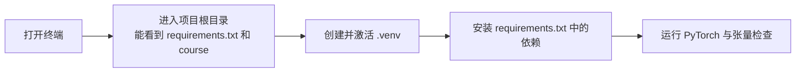

# 第 00 章：学习前准备

`source_mode=foundation` · 无对应视频 · 预计 3–5 小时

## 1. 本章只解决什么问题

本章只负责让你能顺利运行后面的代码并读懂最常见的 Shape。完成后，你应该会进入正确目录、启用独立 Python 环境、运行脚本、读取报错，并看懂列表、张量、字典、集合和最小的类。

这里不检查视频时间、截图或 M 编号。它们从第 01 章才开始。

## 2. 学习前检查

你应当已经会：

- 给变量赋值，例如 `name = "GPT"`；
- 使用列表、`for` 循环和函数；
- 看懂 `if`；
- 在电脑中找到一个文件夹。

如果其中某项完全陌生，先补一节 Python 基础课。本教材会补类和模块，但不会从 `print()` 重新教 Python。

## 3. 不使用术语的直观例子

把一张表想成四个学生连续三天的分数：

```text
学生 0：[80, 90, 70]
学生 1：[60, 75, 88]
学生 2：[92, 81, 79]
学生 3：[55, 68, 72]
```

它有 4 行、每行 3 个数，所以 Shape 是 `[4,3]`。后面写成 `[B,T]` 时，`B` 就像学生数，`T` 就像每个学生有多少个连续位置。字母只是尺寸标签，不是新的数据。

维度是“需要几个索引才能拿到一个数”：

- `scores[1]` 得到学生 1 的一整行；
- `scores[1][2]` 得到学生 1 的第 3 天分数 88；
- Python 从 0 开始编号。

## 4. 跟着完成最小代码

### 本章与代码主线的关系

本章没有 V 版本文件。这里的命令只负责确认 Python、虚拟环境和 PyTorch 能工作；V0 从第 02 章开始。命令后的预期输出就是本章的完整验收，不需要到其他目录寻找隐藏脚本。

### 4.1 打开终端和正确目录

终端是“用文字告诉电脑做什么”的窗口。先进入本项目根目录，也就是能看到 `requirements.txt` 和 `course` 的目录。

后面的准备工作始终沿着同一条路径进行。先确认自己站在项目根目录，再创建并激活独立环境；只有环境正确，安装依赖和运行检查才有意义。



如果某一步失败，就停在该步排查，不要跳到后面继续运行。例如还没有激活 `.venv` 时就安装依赖，包可能会被装到系统 Python，下一次打开终端后仍然找不到。

检查 Python：

```bash
python3 --version
```

代码使用 `X | None` 语法，需要 Python 3.10 或更高版本。

### 4.2 建立独立环境

macOS / Linux：

```bash
python3 -m venv .venv
source .venv/bin/activate
python -m pip install -r requirements.txt
```

Windows PowerShell：

```powershell
py -3.10 -m venv .venv
.venv\Scripts\Activate.ps1
python -m pip install -r requirements.txt
```

命令行开头出现 `(.venv)`，表示当前终端正在使用这个项目自己的 Python。每次重新打开终端都要再次激活，但不必重复安装。

### 4.3 验证 PyTorch

```bash
python -c "import torch; print(torch.__version__); print(torch.tensor([[1, 2], [3, 4]]).shape)"
```

预期最后看到 `torch.Size([2, 2])`。

### 4.4 运行本章最小检查

```bash
python -c "import torch; x = torch.tensor([[10, 20, 30], [40, 50, 60]]); print(x[:, :2])"
```

预期输出：

```text
tensor([[10, 20],
        [40, 50]])
```

## 5. 每行代码在做什么

先运行这段最小例子：

```python
import torch

rows = [[10, 20, 30], [40, 50, 60]]
x = torch.tensor(rows, dtype=torch.long)
print(x)
print(x.shape)
print(x.ndim)
print(x.dtype)
print(x[1, 2])
print(x[:, :2])
```

- `import torch`：载入 PyTorch 模块，之后用 `torch.名字` 调用它的功能。
- `rows`：普通 Python 的嵌套列表。
- `torch.tensor(rows, ...)`：把数字装进张量。张量可以理解为“支持高效计算、能放到不同设备上的规则数字盒子”。
- `dtype=torch.long`：每个格子存整数；token ID 必须是整数。
- `x.shape`：每个轴的长度，这里是 `[2,3]`。
- `x.ndim`：轴的数量，这里是 2。
- `x[1,2]`：第 2 行第 3 列，得到 60。
- `x[:, :2]`：所有行、前两列，得到 Shape `[2,2]`。

### 你还会遇到的 Python 写法

```python
chars = {"a", "b", "a"}          # 集合：自动去重
stoi = {"a": 0, "b": 1}          # 字典：用字符查编号

class Counter:
    def __init__(self, start):
        self.value = start

    def add(self, amount):
        self.value += amount

counter = Counter(3)
counter.add(2)
print(counter.value)                # 5
```

类是一张“怎样制造对象”的蓝图。`__init__` 在创建对象时运行，`self` 指当前这个对象。后面的模型类会继承 `nn.Module`，从而让 PyTorch 自动找到其中可学习的数字。你现在只需读懂，不必独立设计类。

## 6. Shape 变化卡片

```text
Python 嵌套列表：2 行，每行 3 个数
        │ torch.tensor
        ▼
张量 x：[2,3]，dtype=torch.int64
        │ x[:, :2]
        ▼
切片结果：[2,2]
        │ x[1, 1]
        ▼
单个数：Shape []
```

`Shape []` 不是“没有值”，而是一个不再有行列轴的标量。

## 7. 为什么这样设计

普通列表适合保存一般 Python 对象；张量适合统一数值计算。PyTorch 还能记录计算经过的操作，后面据此计算怎样调整模型。此处只建立使用习惯，不提前解释梯度算法。

模块导入让代码可以拆文件复用。`nn.Module` 让模型里的层、参数、训练/评估状态被统一管理。因此课程会使用类，而不是把所有逻辑写进一个巨大函数。

## 8. 常见误解与报错

| 现象 | 最常见原因 | 先做什么 |
|---|---|---|
| `python: command not found` | 系统命令名是 `python3` | 运行 `python3 --version` |
| `ModuleNotFoundError: torch` | 环境未激活或依赖未安装 | 激活 `.venv`，再安装 requirements |
| `FileNotFoundError` | 当前目录不对或素材不完整 | 确认能看到项目的 `course` 目录 |
| `IndexError` | 索引超出 Shape | 打印 `x.shape` 与实际索引 |
| `Expected ... same device` | 模型和数据不在同一设备 | 先打印各自 `.device` |
| Shape 不符合预期 | 切片少一列、多一层或轴顺序错 | 在每个中间步骤打印 `.shape` |

读报错时先看最后一行，它通常写错误类型；再向上找第一个属于本项目的文件和行号。不要从整屏红字的第一行开始猜。

## 9. 完整示范

在 Python 交互环境或临时练习文件中运行：

```python
import torch

data = torch.tensor([[5, 7, 9], [2, 4, 6]], dtype=torch.long)
assert data.shape == (2, 3)
assert data.ndim == 2
assert data[0, 1].item() == 7

first_two = data[:, :2]
assert first_two.shape == (2, 2)
print("data:", data.tolist())
print("shape:", tuple(data.shape))
print("dtype:", data.dtype)
print("first_two:", first_two.tolist())
```

`assert` 是主动检查：条件不成立就立刻报错。后面的版本代码经常用它保护 Shape 和语义。

## 10. 填空模仿

把空白补成一个 3 行 4 列的整数张量，并取所有行的最后两列：

```python
import torch

x = torch.tensor(
    [[1, 2, 3, 4], [5, 6, 7, 8], [9, 10, 11, 12]],
    dtype=____,
)
tail = x[____, ____]
assert x.shape == (____, ____)
assert tail.tolist() == [[3, 4], [7, 8], [11, 12]]
```

参考答案：`torch.long`、`:`、`-2:`、`3`、`4`。

## 11. 独立小任务

不看上面的代码，完成以下任务：

1. 激活项目环境并运行 4.4 的最小检查；
2. 新建一个 Shape 为 `[2,3]` 的浮点张量；
3. 打印它的 `shape`、`ndim`、`dtype`、第一行和最后一列；
4. 故意访问不存在的第 4 行，指出报错类型，并恢复代码。

验收参考：浮点类型通常显示为 `torch.float32`；第一行 Shape 是 `[3]`，最后一列 Shape 是 `[2]`；越界应触发 `IndexError`。完成后恢复故意制造越界的练习代码。

## 12. 过关标准

- 能说明终端、工作目录、虚拟环境各自是什么；
- 能独立运行本章最小检查，并知道终端命令应在项目根目录执行；
- 看到 `[B,T,C]` 时知道它是三个轴的长度；
- 能用索引和切片取得一行、一列或一个位置；
- 能说出字典、集合、类和 `__init__` 的最小作用；
- 遇到报错先找到错误类型、项目文件行号和实际 Shape。

## 13. 暂时不用懂什么

暂时不用懂 Attention、矩阵乘法、梯度公式、概率分布、GPU 并行原理、类的高级继承规则。下一章也不需要你背 PyTorch API。

[返回课程目录](../README.md) · [下一章：我们究竟要构建什么](../01-我们究竟要构建什么/README.md)
