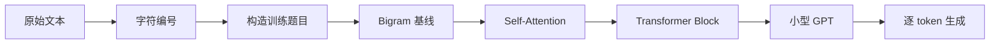
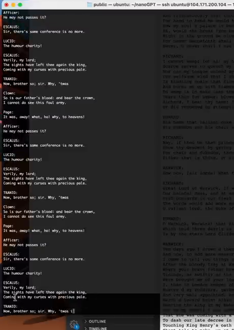

# 第 01 章：我们究竟要构建什么

`source_mode=video` · 视频 00:00–07:29 · M001–M011 · 预计 1 小时

## 1. 本章只解决什么问题

这一章只建立课程地图：语言模型在做什么，我们最后会得到什么，以及它与 Transformer、GPT、ChatGPT、nanoGPT 分别是什么关系。暂时不写训练代码。

学完后，你应当能用不超过三句话准确介绍本课程，不再把“小型 GPT”误认为“复现 ChatGPT”。

## 2. 学习前检查

只需完成第 00 章，能运行 Python 文件即可。不要求知道 token、神经网络或概率；这些词会在首次使用处解释。

## 3. 不使用术语的直观例子

给你开头 `猫`，请猜下一个字符。可能是 `咪`、`在`、`的`，也可能是标点。给出 `猫在窗` 后，你更可能猜 `边`。这类任务不是先写一条固定答案规则，而是根据已看到的内容，为“接下来是什么”给出多个可能性。

生成时重复同一动作：

```text
已有：猫
猜一个：在      → 猫在
再猜一个：窗    → 猫在窗
再猜一个：边    → 猫在窗边
```

这就是本课模型的核心行为：逐个补出 token。token 是模型一次处理的文本单位；此处先把它当作一个字符，第 02 章再把它具体化为字符编号。

接下来的章节不是一组互不相关的知识点，而是一条从原始文本走到文本生成的装配路线：



每一章只补上一块能力。前面的字符编号、训练样本和 Bigram 不是绕路，它们会让后面的 Attention 和完整 GPT 有清楚的输入、输出与对照基线。

## 4. 跟着完成最小代码

本章没有单独的 V 版本文件，只用下面的章内示例理解生成外形；主线 V0 从第 02 章开始。

用一个手工函数模拟“每次追加一个字符”的外形：

```python
choices = {
    "猫": ["在", "咪"],
    "在": ["窗", "家"],
    "窗": ["边", "口"],
}

text = "猫"
for _ in range(3):
    last = text[-1]
    next_char = choices.get(last, ["。"]) [0]
    text += next_char
    print(text)
```

这不是机器学习模型，只是让你先看清“取已有序列 → 选一个新字符 → 拼回去”的生成循环。真正模型不会靠我们手写字典，而会从训练文本中调整大量数字。

## 5. 每行代码在做什么

- `choices` 是人工写好的候选表；真实模型的候选分数由可学习参数给出。
- `text[-1]` 取得当前最后一个字符。
- `.get(..., ["。"])` 在没有候选时给默认值。
- `[0]` 固定选第一个，因此每次结果相同；真实生成可以按概率抽样，所以同一开头可能产生不同文本。
- `text += next_char` 把新字符追加到已有内容。

四个名称先这样记：

| 名称 | 本课中的最小含义 |
|---|---|
| 语言模型 | 根据前文给下一个 token 打分 |
| Transformer | 让不同位置的信息交流并进行计算的一类网络结构 |
| GPT | 使用 Transformer 的 decoder-only 形式做生成式预训练模型 |
| ChatGPT | 在更大 GPT 类模型上再加入助手训练、安全与产品系统后的应用 |

## 6. Shape 变化卡片

先只看序列长度，不引入张量：

```text
"猫"        长度 1
  │ 追加 "在"
"猫在"      长度 2
  │ 追加 "窗"
"猫在窗"    长度 3
```

第 05 章会把它写成 `[B,T] → [B,T+1]`：一次只让时间长度 `T` 增加 1。

## 7. 为什么这样设计

Tiny Shakespeare 只有约 111 万字符，词表只有 65 个字符，普通电脑可以快速验证数据管线和模型结构。它的任务足够小，让我们看清每一步；但它也决定了模型只能学习这种文本的局部模式。

nanoGPT 是更接近工程训练的实现。本课程使用更慢、更直白的代码拆开每个部件，最后再把两者对应起来。两者不是两个互相竞争的模型。

## 8. 常见误解与报错

- “会生成英文”不等于“理解剧情”。局部拼写、标点和角色格式也能产生像样外观。
- Transformer 是结构家族，不等于 ChatGPT 产品。
- GPT 不是所有 Transformer；原始 Transformer 同时有 encoder 和 decoder。
- “从零构建”指从空教学文件搭核心结构，不指从晶体管实现 PyTorch，也不指从零训练商业规模模型。
- 视频中的随机生成每次可不同，因此文本不逐字一致不是代码错误。

## 9. 完整示范

给前文“天上下起了”，列出候选并说明依据：

```text
候选“雨”：常见搭配，可能性较高
候选“雪”：语法成立，取决于上下文
候选“冰”：单独接在这里较少见
```

语言模型不会先输出唯一正确字符，而是给整个候选词表打分，再选择一个。选择后，新字符成为下一轮前文的一部分。

先看课程最终要实现的生成外形。视频里的模型也是从一小段开头出发，一次选择一个新 token，再把它放回上下文继续预测。



*图：字符级模型根据已有文本逐 token 续写的效果（原视频 M009，00:05:15）*

这里要观察的是文本会持续变长，而且生成内容具有类似莎士比亚文本的拼写、标点和角色格式。这只能说明模型学会了训练文本中的局部模式，不能据此断言它理解了人物或剧情。

## 10. 填空模仿

补全下面的生成过程：

```text
已有前文：“今天天气”
可能的下一个字符：____、____、____
选择其中一个后，序列长度从 ____ 变成 ____。
下一轮预测时，模型看到的前文应该包含 / 不包含新字符。（圈选）
```

参考答案不唯一。例如候选可以是“很”“真”“不”；原长度 4，追加后长度 5；下一轮包含新字符。

## 11. 独立小任务

任选一句不少于 6 个字符的话：

1. 截去最后两个字符，只保留前文；
2. 为下一个字符写至少 3 个合理候选；
3. 说明为什么同一前文可能生成不同结果；
4. 用两栏写出“课程会完成”和“课程不会完成”，各至少两项。

验收参考：会完成的应包含字符编码、训练小型 decoder-only Transformer、逐 token 生成；不会完成的应包含商业规模训练、可靠知识问答、完整 ChatGPT 后训练或产品系统。

## 12. 过关标准

- 能解释语言模型为何是“逐 token 续写器”；
- 能区分 Transformer、GPT 与 ChatGPT；
- 能说明 Tiny Shakespeare、教学代码和 nanoGPT 的关系；
- 能明确最终成果是小型字符模型，不是 ChatGPT 复刻；
- 能解释同一提示为什么可能得到不同结果。

## 13. 暂时不用懂什么

暂时不用懂 token 如何编号、概率怎样算、参数如何训练、Attention 公式和 nanoGPT 的工程优化。下章只解决第一件事：文本怎样变成模型能接收的数字。

## 14. 原视频定位与 M 映射

| M | 原视频时间 | 本章用途 |
|---|---|---|
| M001 | 00:00:00–00:00:36 | 逐 token 输出观察 |
| M002 | 00:00:36–00:01:03 | 随机生成 |
| M003 | 00:01:03–00:01:38 | 文本任务多样性 |
| M004 | 00:01:38–00:02:07 | 序列补全目标 |
| M005 | 00:02:07–00:02:44 | ChatGPT 与 Transformer |
| M006 | 00:02:44–00:03:13 | 原始翻译架构背景 |
| M007 | 00:03:13–00:03:52 | 课程能力边界 |
| M008 | 00:03:52–00:04:16 | Tiny Shakespeare 数据 |
| M009 | 00:04:16–00:05:21 | 字符预测与生成预览 |
| M010 | 00:05:21–00:06:25 | nanoGPT 关系 |
| M011 | 00:06:25–00:07:29 | 从空文件搭建与前置要求 |

[上一章：学习前准备](../00-学习前准备/README.md) · [返回课程目录](../README.md) · [下一章：文本如何变成数字](../02-文本如何变成数字/README.md)
