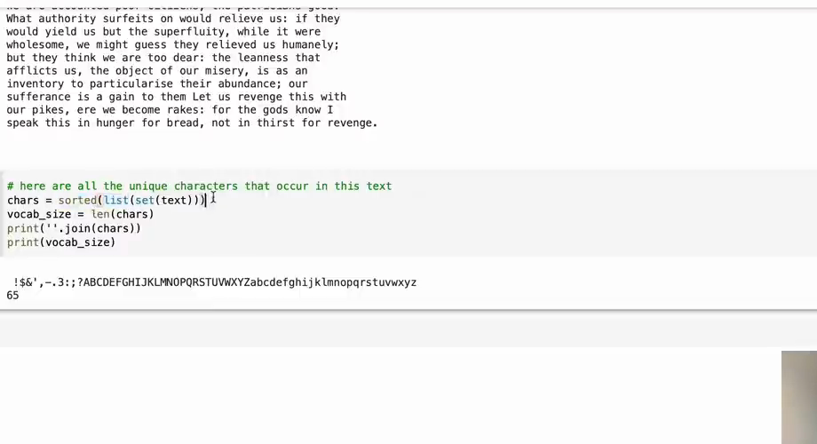

# 第 02 章：文本如何变成数字

`source_mode=video` · 视频 07:29–12:45 · M012–M017 · 预计 1.5–2 小时

## 1. 本章只解决什么问题

模型只能接收数字。本章把字符串变成整数列表，再无损变回原字符串。你会建立字符词表、`stoi`、`itos`、`encode` 和 `decode`，但还不制作训练 batch。

## 2. 学习前检查

你需要会字符串、列表、字典、集合、函数和索引。忘了字典或集合可以回看第 00 章，不需要先学机器学习。

## 3. 不使用术语的直观例子

把字符词表想成通讯录：

```text
"!" → 0
"a" → 1
"b" → 2
"c" → 3
```

文本 `cab!` 就能写成 `[3,1,2,0]`。反向通讯录把 3 查回 `c`、1 查回 `a`，于是恢复原文。

“token”只是一次被当作一个单位处理的文本片段。本课让每个字符都是一个 token，所以空格、换行和标点也各有编号。

## 4. 视频关键片段与画面

- `07:29–08:34`（M012）：读取并检查原始文本。
- `08:34–09:36`（M013）：`set` 去重，`sorted` 固定顺序，得到 65 个字符。
- `09:36–11:43`（M014–M015）：建立双向查找和编码/解码。
- `11:43–12:45`（M016–M017）：字符与 subword 的长度—词表权衡。



画面核对 `set + sorted` 得到稳定字符词表；实际运行读取本地 `sources/ng-video-lecture/input.txt`，不需要每次联网下载。

## 5. 跟着完成最小代码

先在纸上预测输出，再运行：

```python
text = "cabca!"
chars = sorted(set(text))
stoi = {char: index for index, char in enumerate(chars)}
itos = {index: char for char, index in stoi.items()}

def encode(string):
    return [stoi[char] for char in string]

def decode(tokens):
    return "".join(itos[token] for token in tokens)

tokens = encode("cab!")
print(chars)
print(stoi)
print(tokens)
print(decode(tokens))
assert decode(encode("cab!")) == "cab!"
```

然后运行完整 V0：

```bash
python course/02-文本如何变成数字/code/V0-text-vocabulary.py
```

## 6. 每行代码在做什么

- `set(text)` 删除重复字符，但集合没有我们需要的稳定编号顺序。
- `sorted(...)` 排序，使同一份文本每次得到相同词表。
- `enumerate(chars)` 同时给出编号和字符。
- `stoi` 是 string-to-integer：字符查编号。
- `itos` 是 integer-to-string：编号查字符。
- `encode` 对字符串中的每个字符查表。
- `decode` 查回字符，再用空字符串 `""` 连接。
- `assert` 验证往返不丢信息。

如果编码一个词表中没有的字符，`stoi[char]` 会触发 `KeyError`。本课训练和生成都使用同一份已知词表，所以不额外加入“未知字符”编号。

## 7. Shape 变化卡片

```text
字符串 "cab!"：4 个字符
        │ encode
        ▼
Python 列表 [3,1,2,0]：长度 4
        │ torch.tensor(..., dtype=torch.long)
        ▼
一维张量：Shape [4]
        │ decode(tensor.tolist())
        ▼
字符串 "cab!"
```

这里还没有 batch，所以没有 `B` 轴；也还没有把一个 token 表示成多个特征，所以没有 `C` 轴。

## 8. 为什么这样设计

字符级方案词表小、实现透明，但一句话会变成较长序列。subword 分词把常见字符片段合成一个 token，序列更短、词表更大，规则也更复杂。本课选择字符级，是为了把注意力放在模型结构，不是说它在现代大模型中总是更好。

数字编号没有大小含义。编号 40 的字符并不比编号 3 的字符“更大”；它只是通讯录页码。模型下一步会用编号查表取得可学习表示。

## 9. 常见误解与报错

- `sorted(set(text))` 不是按出现频率排序，而是按字符排序。
- 词表大小不是文本长度。Tiny Shakespeare 有约 111 万字符，但只有 65 种字符。
- `stoi` 的值只是 ID，不是概率和含义。
- 换行 `\n` 是一个字符；打印时可能表现为真正换行。
- `KeyError: '…'` 通常意味着待编码字符不在建立词表所用文本中。
- 训练时不能临时改变 `stoi` 顺序，否则同一个编号会代表不同字符。

## 10. 完整示范

```python
import torch

text = "香蕉，香甜"
chars = sorted(set(text))
stoi = {ch: i for i, ch in enumerate(chars)}
itos = {i: ch for ch, i in stoi.items()}

sample = "香甜"
ids = [stoi[ch] for ch in sample]
data = torch.tensor(ids, dtype=torch.long)
restored = "".join(itos[i] for i in data.tolist())

assert restored == sample
assert data.shape == (2,)
print("vocabulary:", chars)
print("ids:", ids)
print("restored:", restored)
```

## 11. 填空模仿

```python
text = "book"
chars = ____(set(text))
stoi = {char: index for index, char in ____(chars)}
itos = {index: char for char, index in stoi.____()}

def encode(string):
    return [____[char] for char in string]

def decode(tokens):
    return "".join(____[token] for token in tokens)

assert decode(encode("book")) == "book"
```

参考答案依次是 `sorted`、`enumerate`、`items`、`stoi`、`itos`。

## 12. 独立小任务

为字符串 `"hello, GPT!"` 建立字符词表：

1. 打印词表和词表大小；
2. 编码 `"GPT!"`；
3. 解码并用 `assert` 验证；
4. 预测编码 `"gpt"` 会在哪个字符失败，并实际验证；
5. 用一句话说明为什么字符 ID 的数值差没有语义。

参考检查：原文本含大写 `G/P/T`，但不含小写 `g/p/t`，第一个小写 `g` 就会引发 `KeyError`。不要通过静默删除未知字符来“修复”，那会破坏往返。

## 13. 过关标准

- 能用 `sorted(set(text))` 建立稳定字符词表；
- 能独立写出双向字典和编码/解码函数；
- 能验证 `decode(encode(s)) == s`；
- 能解释词表外字符错误；
- 能直观比较字符 token 与 subword token，而无需实现 BPE。

## 14. 暂时不用懂什么

暂时不用懂 BPE 的合并算法、Unicode 规范化、生产级 tokenizer、Embedding 的训练方式和概率。下章只把一长串 token ID 切成练习题。

## 15. 视频时间与 M 映射

| M | 时间 | 本章用途 |
|---|---|---|
| M012 | 00:07:29–00:08:34 | 读取原始文本 |
| M013 | 00:08:34–00:09:36 | 建立 65 字符词表 |
| M014 | 00:09:36–00:10:20 | Tokenizer 目的 |
| M015 | 00:10:20–00:11:43 | `stoi/itos` 与往返 |
| M016 | 00:11:43–00:12:05 | 字符与 subword 对比 |
| M017 | 00:12:05–00:12:45 | 词表大小与序列长度权衡 |

[上一章：我们究竟要构建什么](../01-我们究竟要构建什么/README.md) · [返回课程目录](../README.md) · [下一章：如何制作训练题目](../03-如何制作训练题目/README.md)
