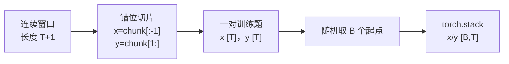
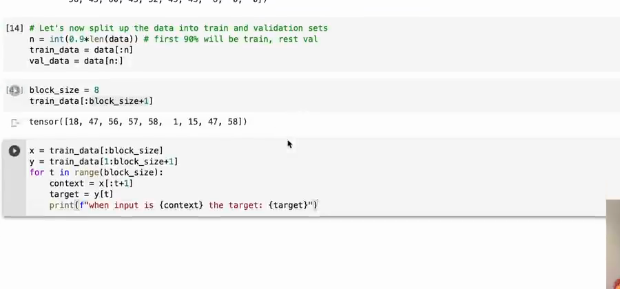
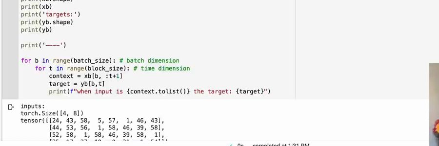

# 第 03 章：如何制作训练题目

`source_mode=video` · 视频 12:45–22:16 · M018–M029 · 预计 2–3 小时

## 1. 本章只解决什么问题

本章把一条很长的 token 序列切成模型能练习的“输入题面”和“正确答案”。你会理解训练/验证切分、`block_size+1`、错位一格的 `x/y`、随机起点和 `[B,T]` batch。

本章不创建模型，也不讨论模型怎样修改参数。

## 2. 学习前检查

你需要能把文本编码成整数，能看懂一维张量、切片和 `torch.long`。请先确保第 02 章的编码解码往返已经通过。

## 3. 不使用术语的直观例子

原序列是：

```text
[10, 20, 30, 40, 50]
```

把左边四个当题面、右边四个当答案：

```text
x = [10, 20, 30, 40]
y = [20, 30, 40, 50]
```

于是同一行里藏着四道题：

```text
看到 [10]             → 答 20
看到 [10,20]          → 答 30
看到 [10,20,30]       → 答 40
看到 [10,20,30,40]    → 答 50
```

要做长度为 4 的题，必须先取 5 个连续 token，这就是 `block_size+1`。

从长序列到一个 batch，可以拆成三个不会混淆的动作：



先保证一行里的 x/y 正确错位，再考虑抽取多行。这样 Shape 出错时，可以判断问题发生在“切窗口”还是“叠 batch”。

## 4. 跟着完成最小代码

```python
import torch

data = torch.arange(20, dtype=torch.long)
split_index = int(0.9 * len(data))
train_data = data[:split_index]
val_data = data[split_index:]

block_size = 4
chunk = train_data[3 : 3 + block_size + 1]
x = chunk[:-1]
y = chunk[1:]

print("chunk:", chunk.tolist())
print("x:", x.tolist())
print("y:", y.tolist())

for t in range(block_size):
    context = x[: t + 1]
    target = y[t]
    print(context.tolist(), "->", target.item())
```

再运行 V1：

```bash
python course/03-如何制作训练题目/code/V1-data-pipeline.py
```

## 5. 每行代码在做什么

- `int(0.9 * len(data))` 找到九成位置。
- 前九成用于训练；后一成只用于检查模型对没参与训练的文本表现如何。
- `chunk` 取 `block_size+1` 个数，才能组成同样长的输入与答案。
- `chunk[:-1]` 去掉最后一个，作为输入。
- `chunk[1:]` 去掉第一个，作为向右错一位的目标。
- `x[:t+1]` 取从开头到当前位置的上下文。
- `.item()` 把只有一个值的张量取成普通 Python 数。

完整 V1 的 `get_batch` 会随机选 `B` 个起点，再把各行用 `torch.stack` 叠起来。

## 6. Shape 变化卡片

设 `B=4`、`T=8`：

```text
全文 token：              [N]
随机起点之一切 T+1 个：   [9]
去首/去尾：x [8]，y [8]
堆叠 4 份：x [4,8]，y [4,8]
展开看训练位置：4×8 = 32 个目标
```

`B` 是同时抽了几段，`T` 是每段保留几个连续位置。不同 batch 行不是同一个长句的延续。

视频中的切片可以直接核对 x 与 y 是否只错开一个位置：



*图：用 `chunk[:-1]` 和 `chunk[1:]` 构造等长 x/y（原视频 M022，00:16:22）*

重点不是记住两个切片写法，而是确认每个 `y[t]` 正好是 `x[t]` 后面的 token。接下来 `stack` 只负责增加 B 轴，不应改变这种行内对应关系。

## 7. 为什么这样设计

不把全文一次送入模型，原因包括计算量太大，以及模型只需要练习有限长度的上下文。随机窗口让每次训练看到文本的不同位置。

同一长度 `T` 的窗口同时训练 1、2、…、T 个 token 的上下文。这既提高数据利用率，也让生成可以从很短的开头启动。

训练集与验证集分开，目的是区分“记住训练文本”与“对未参与更新的同类文本也有效”。验证集可以计算 loss，但不能调用 `backward()` 或 `optimizer.step()`。

## 8. 常见误解与报错

- x 和 y 必须 Shape 相同，但内容错位一 token；完全相同会让模型学习复制当前 token。
- `block_size=8` 时切片长度是 9，不是 8。
- 起点最大值必须给最后一个目标留空间，否则某行会变短，`stack` 失败。
- `torch.stack` 新增一个轴；`torch.cat` 是沿已有轴拼接，二者不同。
- batch 中各行共同形成平均 loss 和梯度，不代表前向时第 0 行能读取第 1 行。
- 训练/验证切分不是每次随机抽 90%；本课用连续切分保留不同文本片段。

## 9. 完整示范

```python
import torch

source = torch.arange(30, dtype=torch.long)
B, T = 3, 4
starts = torch.tensor([0, 5, 10])

x = torch.stack([source[i : i + T] for i in starts])
y = torch.stack([source[i + 1 : i + T + 1] for i in starts])

assert x.shape == y.shape == (B, T)
assert torch.equal(y[:, :-1], x[:, 1:])
print("x:\n", x)
print("y:\n", y)
```

第二个断言验证每行中，`y` 的前 T−1 个位置等于 `x` 从第 2 个位置开始的内容。

再对照视频里的真实 batch 输出，可以确认随机窗口最终都被整理为相同的 `[B,T]`：



*图：四个随机窗口经 `torch.stack` 形成 `[4,8]` 的运行结果（原视频 M028，00:20:09）*

画面中的每一行都是独立文本片段；行与行不会在模型前向时互相读取，但 32 个位置会共同参与一次 loss 和参数更新。

## 10. 填空模仿

```python
import torch

data = torch.arange(50)
B, T = 2, 5
starts = torch.tensor([3, 20])

x = torch.____([data[i : i + ____] for i in starts])
y = torch.stack([data[i + ____ : i + ____ + 1] for i in starts])

assert x.shape == (____, ____)
assert y[0].tolist() == [4, 5, 6, 7, 8]
```

参考答案：`stack`、`T`、`1`、`T`、`B`、`T`。

## 11. 独立小任务

用序列 `[3,1,4,1,5,9,2,6,5,3]` 完成：

1. 设 `block_size=4`，从位置 2 取一个 `chunk`；
2. 写出 x 和 y；
3. 列出这一行隐含的四道“上下文 → 目标”题；
4. 再从位置 0 和位置 5 各取一行，组成 `[B,T]`；
5. 说明为什么位置 6 不能作为该序列中长度 4 窗口的起点。

参考核对：位置 2 的 `chunk=[4,1,5,9,2]`，`x=[4,1,5,9]`，`y=[1,5,9,2]`。位置 6 后只有 4 个 token，缺少第 5 个目标。

## 12. 过关标准

- 能解释训练集与验证集的职责；
- 能说明为什么取 `block_size+1`；
- 能手工写出错位一格的 x/y；
- 能从多条一维序列组成 `[B,T]`；
- 能说明 batch 内各行前向隔离，但会共同形成一次更新；
- 能运行 V1 并解释它打印的每个 Shape。

## 13. 暂时不用懂什么

暂时不用懂 loss、梯度、optimizer、Embedding 和 Attention。下一章先做一个只看当前 token 的最小模型。

## 14. 原视频定位与 M 映射

| M | 原视频时间 | 本章用途 |
|---|---|---|
| M018 | 00:12:45–00:13:48 | 编码全文与训练/验证切分 |
| M019 | 00:13:48–00:14:50 | `block_size` 作用 |
| M020 | 00:14:50–00:15:26 | 取 `block_size+1` |
| M021 | 00:15:26–00:15:52 | 一段包含多道题 |
| M022 | 00:15:52–00:16:30 | 构造 x/y |
| M023 | 00:16:30–00:16:56 | 打印 context/target |
| M024 | 00:16:56–00:17:32 | 多种上下文长度 |
| M025 | 00:17:32–00:17:58 | batch 轴与隔离 |
| M026 | 00:17:58–00:18:44 | 随机起点 |
| M027 | 00:18:44–00:19:28 | `stack` 得到 `[B,T]` |
| M028 | 00:19:28–00:20:10 | `B×T` 训练位置 |
| M029 | 00:20:10–00:22:16 | 共同估计梯度而不通信 |

[上一章：文本如何变成数字](../02-文本如何变成数字/README.md) · [返回课程目录](../README.md) · [下一章：第一个 Bigram 模型](../04-第一个Bigram模型/README.md)
