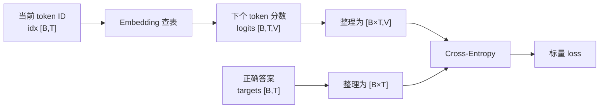
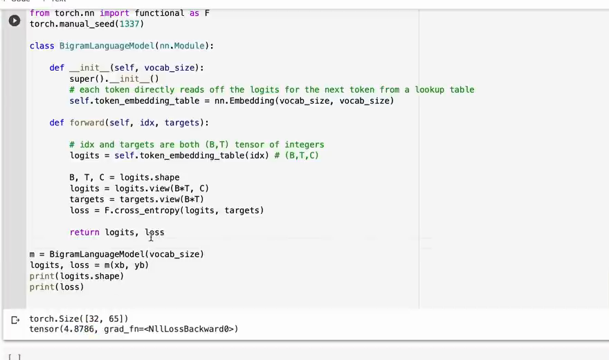

# 第 04 章：第一个 Bigram 模型

`source_mode=video` · 视频 22:16–28:37 · M030–M039 · 预计 2–3 小时

## 1. 本章只解决什么问题

本章建立第一个真的可训练模型：它只根据当前字符为下一个字符打分。你会第一次使用 `nn.Module`、`nn.Embedding`、logits 和 cross-entropy，并看懂 loss 所需的 Shape 变换。

## 2. 学习前检查

先确认你能构造 `[B,T]` 的整数输入与目标，并知道 x/y 向右错一 token。类只要求会读第 00 章的最小例子。

## 3. 不使用术语的直观例子

想象一张“当前字符 → 下个字符评分”的大表。若词表只有 `a,b,!`，表有 3 行 3 列：

```text
          下个 a   下个 b   下个 !
当前 a       1        4       -1
当前 b       2        0        3
当前 !       0        1        0
```

看到 `a` 就查第 1 行，得到 `[1,4,-1]`。这些原始分数叫 logits；4 最大表示模型此刻更偏向 `b`，但分数还不是概率。

Bigram 的限制也很直接：只按当前字符查一行，因此 `a` 出现在不同句子时得到完全相同分数。

一次前向计算中，输入、模型分数、正确答案和 loss 的关系如下：



模型负责为每个候选字符打分，targets 只在计算 loss 时提供正确编号。把这两条数据流分清，就不会把输入 token、候选类别和答案混为一谈。

## 4. 跟着完成最小代码

```python
import torch
import torch.nn as nn
from torch.nn import functional as F

class TinyBigram(nn.Module):
    def __init__(self, vocab_size):
        super().__init__()
        self.table = nn.Embedding(vocab_size, vocab_size)

    def forward(self, idx, targets=None):
        logits = self.table(idx)
        loss = None
        if targets is not None:
            B, T, V = logits.shape
            loss = F.cross_entropy(
                logits.reshape(B * T, V),
                targets.reshape(B * T),
            )
        return logits, loss

model = TinyBigram(vocab_size=3)
x = torch.tensor([[0, 1], [2, 0]])
y = torch.tensor([[1, 2], [0, 1]])
logits, loss = model(x, y)
print(logits.shape, loss.item())
```

### 主线 V2 与本章的关系

[完整 V2](./code/V2-bigram-model.py)在 V1 数据管线后加入 `BigramLanguageModel`，并一次性保存了两个相邻知识点：本章的模型与 loss，以及第 05 章的逐 token 生成。因此本章运行 V2 时只要求解释输出的前两行；后两行先确认能运行，到下一章再逐行拆解。

在项目根目录运行：

```bash
python course/04-第一个Bigram模型/code/V2-bigram-model.py
```

### 运行结果怎么读

参考输出：

```text
训练用 logits 的形状： (32, 65)
初始损失： 4.7051
生成结果的形状： (1, 21)
未训练模型的样例： '\npxMHoRFJa!JKmRjtXzfN'
```

- `(32,65)` 来自 `B×T=4×8=32` 道题，每道题有 65 个候选字符分数。
- 初始 loss 在 4–5 左右，与 `ln(65)≈4.17` 同一数量级；随机权重不要求精确等于均匀分布。
- `(1,21)` 和乱码属于第 05 章：一个起始 token 加 20 个新 token。乱码恰好说明模型尚未训练，不是程序损坏。
- 固定随机种子通常会复现这里的数字；不同 PyTorch 后端若有细小差异，以 Shape、有限 loss 和长度为判断标准。

## 5. 每行代码在做什么

- `TinyBigram(nn.Module)` 表示这个类拥有 PyTorch 模型的参数管理能力。
- `super().__init__()` 初始化父类；漏掉它会破坏模块注册。
- `nn.Embedding(V,V)` 创建 V 行 V 列的可学习表。
- 调用 `model(x,y)` 时，PyTorch 会转到 `forward`。
- `self.table(idx)` 对每个整数 ID 查一行；输入 `[B,T]` 得到 `[B,T,V]`。
- `targets=None` 允许没有答案时只计算分数。
- cross-entropy 接收“每道题的 V 个分数”和“一个正确类别编号”。
- loss 是一个标量：越小表示给正确字符的相对分数越高。

`model.parameters()` 会找到 Embedding 表中的数字。第 06 章的 optimizer 会修改它们。

### 完整 V2 代码导读

| 代码区块 | 来源或新增内容 | 本章怎样读 |
|---|---|---|
| 导入与 `torch.manual_seed(1337)` | 新增 PyTorch 模型 API 与固定随机种子 | 让初始化、batch 和抽样尽量可复现 |
| 文本、词表、编码、数据切分 | 继承 V0/V1 | 它们为模型提供 65 类输入和训练题，不是本章新知识 |
| `get_batch` | 继承 V1 | 返回 `x/y [4,8]`，作为 `forward` 的输入和答案 |
| `BigramLanguageModel.__init__` | 新增 `Embedding(V,V)` | 建立唯一一张可学习的 `65×65` 转移表 |
| `forward` | 新增 logits 与可选 loss | 有 targets 时展平计算交叉熵；无 targets 时只返回分数 |
| `generate` | 新增但留到第 05 章精读 | 使用 `forward` 的无 targets 路径循环采样 |
| `demo()` | 串起数据、模型、loss 和生成 | 断言接口契约，再打印四个可观察结果 |
| 主入口保护 | 继承统一脚本结构 | 直接运行才执行 `demo()` |

V2 在计算 loss 后返回的是展平后的 `flat_logits [B×T,V]`，这是为了直接断言 cross-entropy 实际接收到的 Shape。这个演示接口与前面概念图中的原始 `[B,T,V]` 不矛盾：展平只发生在 loss 分支中。`loss is not None and torch.isfinite(loss)` 同时检查“确实算了 loss”和“结果不是 `nan/inf`”。

## 6. Shape 变化卡片

设 `B=4,T=8,V=65`：

```text
idx：                         [4,8]
Embedding 查表 logits：       [4,8,65]
reshape：                     [32,65]
targets：                     [4,8] → [32]
cross_entropy：               []  一个 loss
```

这里的最后一轴不是普通隐藏特征，而是 65 个候选字符各一个分数。

## 7. 为什么这样设计

Embedding 通常用来把 ID 查成内部特征；Bigram 把每行直接设成 V 个候选分数，相当于可学习的转移表。它是最小模型，便于单独理解接口、loss 和生成。

Cross-entropy 的直觉：先把 V 个分数转换成相对概率，再看模型给正确编号分了多少；正确项概率越小，惩罚越大。最低必需公式是：

```text
单题 loss = -ln(正确类别的预测概率)
```

若 65 个字符概率都一样，正确字符概率是 `1/65`，loss 为 `-ln(1/65)=ln(65)≈4.17`。随机初始化接近这个数是合理基线，不要求精确等于。

视频第一次运行模型时，也会把实际初始 loss 与这个理论数量级放在一起检查：



*图：随机初始化 loss 与 `ln(65)` 基线的运行对照（原视频 M039，00:28:15）*

实际值约为 4.88，并不需要等于 4.17；随机权重不会产生完全均匀的概率。这里的用途是发现数量级异常，例如 Shape 或类别轴弄错后出现离谱结果。

## 8. 常见误解与报错

- logits 可以为负，也不要求和为 1；概率才在 0 到 1 之间且总和为 1。
- `argmax` 是最大分数的编号，不是分数本身。
- `Embedding(V,V)` 的两个 V 含义不同：行是当前 token，列是下个 token 候选。
- cross-entropy 的类别轴必须在最后整理成 `[N,V]`；直接传 `[B,T,V]` 会被 API 误解轴含义。
- targets 必须是整数类别编号，通常 `dtype=torch.long`，Shape `[N]`。
- `reshape` 只重排视图，不应混乱 x 与 y 的对应顺序。

## 9. 完整示范

手工固定一张表，观察查表：

```python
import torch
import torch.nn as nn

table = nn.Embedding(3, 3)
with torch.no_grad():
    table.weight.copy_(torch.tensor([
        [1.0, 4.0, -1.0],
        [2.0, 0.0, 3.0],
        [0.0, 1.0, 0.0],
    ]))

idx = torch.tensor([[0, 2]])
logits = table(idx)
assert logits.shape == (1, 2, 3)
assert logits[0, 0].tolist() == [1.0, 4.0, -1.0]
print(logits)
```

## 10. 填空模仿

```python
class Bigram(nn.____):
    def __init__(self, vocab_size):
        super().__init__()
        self.table = nn.____(vocab_size, vocab_size)

    def forward(self, idx, targets=None):
        logits = self.____(idx)
        if targets is None:
            return logits, None
        B, T, V = logits.____
        loss = F.cross_entropy(logits.reshape(____, V), targets.reshape(B * T))
        return logits, loss
```

参考答案：`Module`、`Embedding`、`table`、`shape`、`B * T`。

## 11. 独立小任务

设 `B=2,T=3,V=4`：

1. 写出输入、logits、展平 logits、targets 和 loss 的 Shape；
2. 建立 `nn.Embedding(4,4)` 并传入 Shape `[2,3]` 的合法整数张量；
3. 打印 `sum(p.numel() for p in model.parameters())`，解释为什么是 16；
4. 计算均匀随机基线 `ln(4)`，与实际随机 loss 比较。

参考 Shape：`[2,3] → [2,3,4] → [6,4]`，targets `[2,3]→[6]`，loss `[]`。实际 loss 只应“大致接近”1.386，不要求一致。

## 12. 过关标准

- 能说出模型输入、输出、目标和 loss；
- 能解释 `nn.Module`、参数与 Embedding 的最低限度作用；
- 能区分 logits、概率和最终选择；
- 能推出 `[B,T,V] → [B×T,V]`；
- 能用 `ln(V)` 判断随机初始 loss 是否数量级合理。

## 13. 暂时不用懂什么

暂时不用懂参数怎样更新、cross-entropy 的完整推导、反向传播公式和 Attention。下一章只用当前未训练模型完成生成接口。

## 14. 原视频定位与 M 映射

| M | 原视频时间 | 本章用途 |
|---|---|---|
| M030 | 00:22:16–00:22:52 | Bigram 目标 |
| M031 | 00:22:52–00:23:26 | `nn.Module` 与 Embedding |
| M032 | 00:23:26–00:24:10 | `[B,T]` 查表 |
| M033 | 00:24:10–00:24:52 | 直接作为 logits |
| M034 | 00:24:52–00:25:26 | 只看当前 token 的限制 |
| M035 | 00:25:26–00:26:02 | Cross-entropy |
| M036 | 00:26:02–00:26:40 | 类别轴要求 |
| M037 | 00:26:40–00:27:15 | 展平 logits |
| M038 | 00:27:15–00:27:54 | 展平 targets 与 loss |
| M039 | 00:27:54–00:28:37 | `ln(65)` 基线 |

[上一章：如何制作训练题目](../03-如何制作训练题目/README.md) · [返回课程目录](../README.md) · [下一章：逐 token 生成](../05-逐token生成/README.md)
