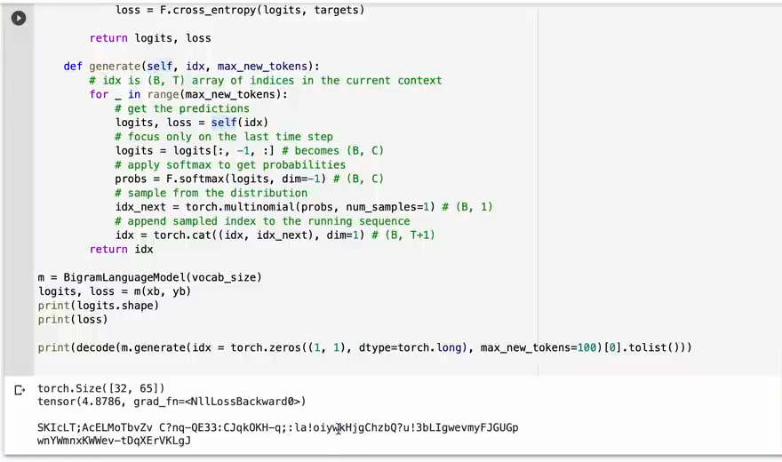

# 第 05 章：逐 token 生成

`source_mode=video` · 视频 28:37–34:57 · M040–M047 · 预计 1.5–2 小时

## 1. 本章只解决什么问题

本章让 Bigram 模型从一个起始 token 出发，每次抽取一个新 token 并拼回序列。你会拆解 `generate` 的五个动作，理解 `softmax`、`multinomial` 与 `cat` 的角色。

## 2. 学习前检查

你应能读懂 Bigram 的 `[B,T,V]` logits，知道 logits 不是概率，并能区分最后时间位置与最后词表类别。

## 3. 不使用术语的直观例子

假设最后位置对三个字符的分数是 `[2,1,0]`。转换后概率大约是 `[0.67,0.24,0.09]`。抽签时第一项更容易被抽中，却不是永远中。

一次生成只有五步：

```text
1. 把已有前缀送入模型
2. 只拿最后位置的 V 个分数
3. 把分数转成概率
4. 按概率抽一个编号
5. 把编号拼到前缀末尾
```

重复五次，就新增五个 token。

把五步连起来，就是一个会把输出重新送回输入的循环：


每一轮只新增一个位置。循环再次执行时，模型看到的上下文已经包含刚才抽到的 token，因此序列会一步步增长。

## 4. 跟着完成最小代码

把这个方法放在 Bigram 类中：

```python
def generate(self, idx, max_new_tokens):
    for _ in range(max_new_tokens):
        logits, _ = self(idx)
        logits = logits[:, -1, :]
        probs = F.softmax(logits, dim=-1)
        idx_next = torch.multinomial(probs, num_samples=1)
        idx = torch.cat((idx, idx_next), dim=1)
    return idx
```

调用：

```python
context = torch.zeros((1, 1), dtype=torch.long)
generated = model.generate(context, max_new_tokens=20)
print(generated.shape)
```

本章继续使用第 04 章的 V2，因为这个版本同时包含 Bigram 模型和完整生成循环：

```bash
python course/04-第一个Bigram模型/code/V2-bigram-model.py
```

## 5. 每行代码在做什么

- 循环次数就是新增长度。
- `self(idx)` 得到每个已有位置的分数；生成时没有 targets，所以 loss 是 `None`。
- `[:, -1, :]` 保留所有 batch、最后时间位置、所有 V 个候选。
- `softmax(..., dim=-1)` 沿 V 轴转概率。
- `multinomial(...,1)` 为每一行抽一个编号，Shape `[B,1]`。
- `cat(...,dim=1)` 沿时间轴 T 追加；不能沿 batch 轴。
- 返回值包含原始前缀，不只包含新增 token。

## 6. Shape 变化卡片

设当前 `B=2,T=4,V=65`：

```text
idx                         [2,4]
model(idx) logits           [2,4,65]
logits[:, -1, :]            [2,65]
softmax                     [2,65]
multinomial                 [2,1]
cat(dim=1)                  [2,5]
```

第二轮的 `T` 变成 5。所有 batch 行各自抽样，B 不变。

## 7. 为什么这样设计

训练时每个位置都有目标，可以并行评分；生成时未来 token 不存在，只能一轮一轮追加。只取最后位置，是因为前面位置对应的“下一个 token”已经存在于当前序列中，不需要重新选。

抽样保留多样性。总取最大概率会更确定，但容易重复；这里先掌握原视频的基础抽样。temperature 和 top-k 放在 V11 选学，不给主线增加负担。

## 8. 常见误解与报错

- `dim=-1` 必须是词表轴；沿时间轴 softmax 会回答错误问题。
- `idx[:, -1]` 得到 `[B]`，而 `idx[:, -1:]` 保留 `[B,1]`；拼接时通常需要后者形状。
- `cat(dim=0)` 会增加 batch 行，不是延长句子。
- `multinomial` 接受非负权重；应先 softmax，不能直接传可能为负的 logits。
- 未训练模型能执行生成流程，但参数是随机的，所以乱码是预期结果。
- 设置相同随机种子可以复现抽样；不设种子时不同输出不代表错误。

## 9. 完整示范

```python
import torch
from torch.nn import functional as F

torch.manual_seed(7)
logits = torch.tensor([[2.0, 1.0, 0.0]])
probs = F.softmax(logits, dim=-1)
next_id = torch.multinomial(probs, num_samples=1)
prefix = torch.tensor([[2, 0, 1]])
extended = torch.cat((prefix, next_id), dim=1)

assert probs.shape == (1, 3)
assert next_id.shape == (1, 1)
assert extended.shape == (1, 4)
print(probs, next_id, extended)
```

这段最小示范只验证一次抽样。把同样的循环用于随机初始化的 Bigram 模型时，程序已经能持续生成，但内容还没有学好：



*图：未训练模型完成生成循环后输出乱码（原视频 M047，00:34:15）*

画面证明生成接口已经跑通，不证明模型已经会写作。此时出现乱码是正确现象；下一章训练参数后，才应该观察 loss 下降和局部文本结构改善。

## 10. 填空模仿

```python
logits, _ = model(idx)
last_logits = logits[:, ____, :]
probs = F.____(last_logits, dim=____)
idx_next = torch.____(probs, num_samples=1)
idx = torch.cat((idx, idx_next), dim=____)
```

参考答案：`-1`、`softmax`、`-1`、`multinomial`、`1`。

## 11. 独立小任务

设输入 `[B,T]=[3,7]`，词表 `V=5`：

1. 写出上述五步中每一步的 Shape；
2. 连续生成 4 次后写出最终 Shape；
3. 修改最小示范，使三个 batch 行各有自己的前缀；
4. 分别用随机抽样和 `argmax` 选择，描述结果稳定性差异。

参考：一次后 `[3,8]`，四次后 `[3,11]`；`argmax` 在分数相同且模型不变时固定，抽样可变化。

## 12. 过关标准

- 能按顺序复述生成五步；
- 能解释为何只取最后时间位置；
- 能推出每一步 Shape；
- 能区分 softmax、multinomial 和 cat 的职责；
- 能说明随机未训练模型为什么会输出乱码。

## 13. 暂时不用懂什么

暂时不用懂 beam search、temperature、top-k、KV cache 和参数更新。下章才让模型学会提高正确字符分数。

## 14. 原视频定位与 M 映射

| M | 原视频时间 | 本章用途 |
|---|---|---|
| M040 | 00:28:37–00:29:14 | 生成循环 |
| M041 | 00:29:14–00:29:56 | targets 可选 |
| M042 | 00:29:56–00:30:36 | 最后时间位置 |
| M043 | 00:30:36–00:31:15 | Softmax |
| M044 | 00:31:15–00:31:54 | Multinomial |
| M045 | 00:31:54–00:32:32 | 沿 T 轴拼接 |
| M046 | 00:32:32–00:33:12 | 起始 token |
| M047 | 00:33:12–00:34:57 | 未训练输出与通用接口 |

[上一章：第一个 Bigram 模型](../04-第一个Bigram模型/README.md) · [返回课程目录](../README.md) · [下一章：模型如何学习](../06-模型如何学习/README.md)
