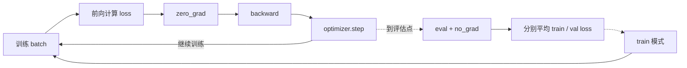
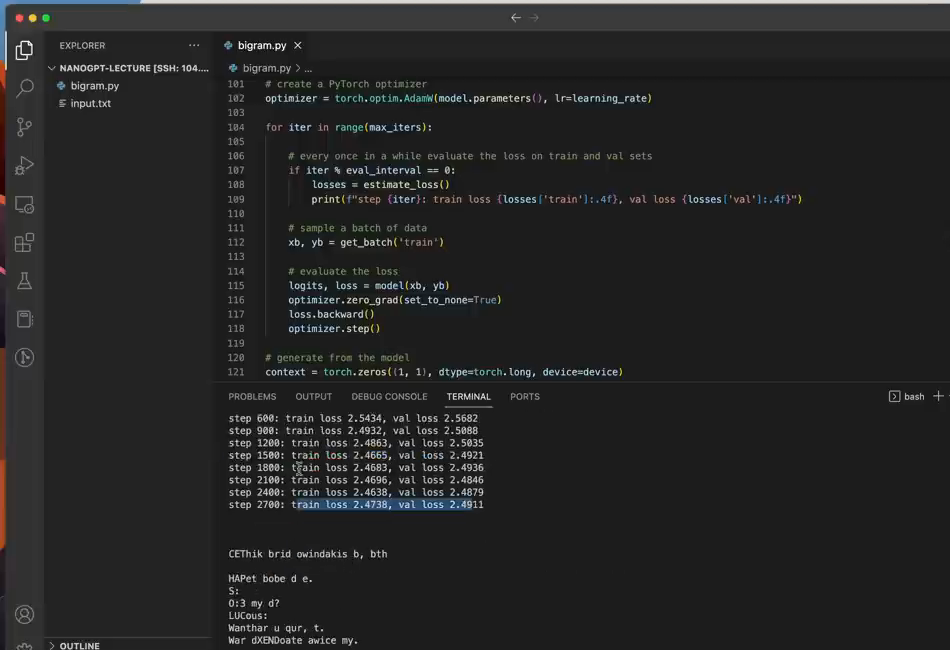
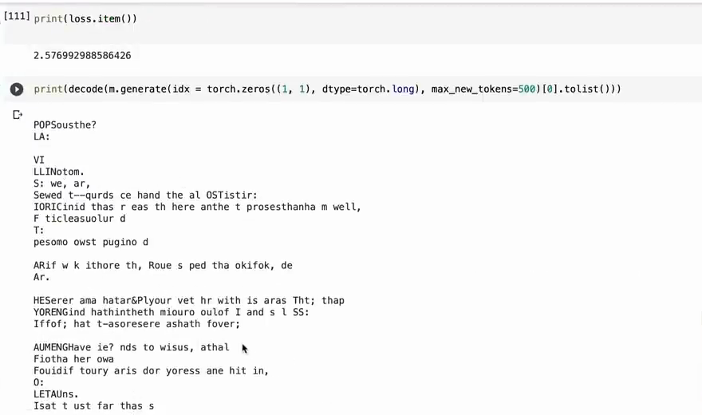

# 第 06 章：模型如何学习

`source_mode=video` · 视频 34:57–42:24 · M048–M055 · 预计 2–3 小时

## 1. 本章只解决什么问题

本章让参数真的改变：取 batch、算 loss、清旧梯度、反向计算方向、让 optimizer 更新。随后用多个 batch 分别估计训练集和验证集表现。

## 2. 学习前检查

你应能运行 Bigram、知道 loss 越小越好，并能指出 `model.parameters()` 中至少包含 Embedding 表。无需知道微积分推导。

## 3. 不使用术语的直观例子

你在山坡上想往低处走。先试探“每个方向会让高度怎样变化”，然后迈一小步。梯度就是局部坡向信息，学习率是步长，optimizer 是决定怎样结合这些信息迈步的规则。

模型的一次练习固定为：

```text
取题 → 作答并算错多少 → 清掉上次方向 → 反推本次方向 → 调整参数
```

训练循环负责改变参数，评估分支只负责测量，两条路径不能混用：



虚线表示评估只是周期性岔路。验证集可以参与前向和 loss 统计，但不能进入 `backward()` 与 `optimizer.step()`。

## 4. 跟着完成最小代码

```python
optimizer = torch.optim.AdamW(model.parameters(), lr=1e-3)

for step in range(100):
    xb, yb = get_batch("train")
    logits, loss = model(xb, yb)
    optimizer.zero_grad(set_to_none=True)
    loss.backward()
    optimizer.step()
```

### 主线 V3 与本章的关系

[完整 V3](./code/V3-trained-bigram.py)保留 V2 的 Bigram 与生成接口，新增设备选择、`estimate_loss`、AdamW 和 500 步训练。也就是说，V3 的模型结构没有升级，变化的是“怎样反复出题、更新参数并可靠比较训练前后”。

在项目根目录运行：

```bash
python course/06-模型如何学习/code/V3-trained-bigram.py
```

### 运行结果怎么读

CPU 上的一次参考输出：

```text
运行设备： cpu
训练前： {'训练集': 4.7322, '验证集': 4.7148}
训练后： {'训练集': 2.5749, '验证集': 2.5877}
生成样例： "..."
```

设备名称可能不同，生成文本也不是本章验收重点。必须同时看到 train/val loss 从约 4.7 降到约 2.6；代码中的断言只要求训练后低于训练前，不把某个浮点数写成唯一答案。

## 5. 每行代码在做什么

- `AdamW` 保存参数引用和自己的更新状态。
- `lr=1e-3` 表示基础步长 0.001；它不是“每个参数固定减 0.001”。
- `get_batch("train")` 只从训练集抽题。
- 前向计算 logits 和 loss。
- `zero_grad` 清除上一步积累的梯度。PyTorch 默认会累加，不清就会把多步方向意外混在一起。
- `loss.backward()` 沿计算过程反向得到每个参数对 loss 的局部影响。
- `optimizer.step()` 根据梯度更新参数。

设备选择：

```python
device = "cuda" if torch.cuda.is_available() else "mps" if torch.backends.mps.is_available() else "cpu"
model = model.to(device)
xb, yb = xb.to(device), yb.to(device)
```

模型、输入和目标必须在同一设备。

### 完整 V3 代码导读

| 代码区块 | 与 V2 的关系 | 作用 |
|---|---|---|
| 随机种子、设备、数据与词表 | 增加设备选择，其余继承 | 让模型和 batch 一起进入 CUDA、MPS 或 CPU |
| `get_batch` | 在 V1 版末尾增加 `.to(device)` | 数据切好后再搬到模型所在设备 |
| `BigramLanguageModel` | 继承 V2 | 保持模型不变，才能把效果变化归因于训练 |
| `@torch.no_grad()` 与 `estimate_loss` | 新增 | 暂停梯度，分别平均多个 train/val batch，再恢复训练模式 |
| `demo()` 的初始化 | 新增模型迁移与 optimizer | optimizer 持有模型参数引用，准备更新同一张 Embedding 表 |
| 500 步循环 | 新增 | 按“取题→前向→清梯度→反向→更新”重复学习 |
| 训练前后评估与断言 | 新增 | 同口径比较两次结果，自动确认两边 loss 都下降 |
| 生成与打印 | 继承并放在训练后 | 用更新后的参数生成，并展示设备、指标和样例 |

`model.eval()`/`model.train()` 在当前 Bigram 中不会改变数值，因为它还没有 Dropout；仍然保留这对调用，是为了建立后续 Transformer 必需的正确评估习惯。`loss.item()` 会把每次 loss 从设备张量取成普通数值存入 CPU 的 `losses`，因此评估不会积累整张计算图。

## 6. Shape 变化卡片

训练不会改变接口 Shape：

```text
xb [B,T]，yb [B,T]
        │ model
logits [B,T,V]，loss []
        │ backward
每个参数得到与自身 Shape 相同的 .grad
        │ optimizer.step
参数 Shape 不变，数值改变
```

梯度不是新增 batch；它依附在各参数上。

## 7. 为什么这样设计

单个随机 batch 的 loss 会抖动，所以可靠评估应抽多个 batch 后平均。训练 loss 说明对训练数据的拟合，验证 loss 说明对未参与更新数据的表现。

三个容易混淆的开关：

| 操作 | 作用 |
|---|---|
| `model.eval()` | 把 Dropout 等层切成评估行为 |
| `torch.no_grad()` | 不记录反向所需计算，省内存和时间 |
| `model.train()` | 恢复训练行为 |

`eval()` 不会自动关闭梯度记录，`no_grad()` 也不会自动改变 Dropout 行为。当前 Bigram 没有 Dropout，所以数值差异不明显，但接口要从现在养成正确习惯。

视频把多个评估点的 train/val loss 并排打印，用来观察两条曲线是否都在改善：



*图：多个评估点上 train/val loss 同步下降的运行结果（原视频 M055，00:42:05）*

这里要看总体趋势，而不是要求每一行都严格下降。若训练 loss 持续下降、验证 loss 明显反弹，才需要考虑模型开始只适应训练文本。

## 8. 常见误解与报错

- 正确顺序是清梯度、反向、更新；`step()` 在 `backward()` 前没有本轮方向。
- 不要在验证集上调用更新步骤，否则验证集不再是独立检查。
- loss 单步上升不等于训练失败；观察多个评估点的总体趋势。
- 学习率过大可能震荡或出现 `nan`，过小则下降很慢。
- `Expected all tensors to be on the same device` 要检查模型参数、x、y 和临时新张量。
- `model.eval()` 不是“计算验证集”的函数，它只切换层的模式。

## 9. 完整示范

用单个数字观察梯度方向：

```python
import torch

w = torch.tensor(0.0, requires_grad=True)
loss = (w - 3) ** 2
loss.backward()
print("loss:", loss.item(), "gradient:", w.grad.item())

with torch.no_grad():
    w -= 0.1 * w.grad

new_loss = (w - 3) ** 2
assert new_loss < loss
print("new w:", w.item(), "new loss:", new_loss.item())
```

这里目标是让 w 接近 3。只需观察梯度告诉我们从 0 应往更大方向走，不要求推导导数公式。

把完整训练循环接到 Bigram 后，loss 会明显降低，生成文本也开始出现局部单词、标点和排版结构：



*图：训练后 loss 降至约 2.57，并出现局部文本结构（原视频 M051，00:37:30）*

这张图同时给出数值证据和直观结果。它说明参数更新有效，但 Bigram 仍只看当前 token，生成质量的上限要由后面的上下文通信解决。

## 10. 填空模仿

```python
optimizer = torch.optim.____(model.parameters(), lr=1e-3)
xb, yb = get_batch("____")
logits, loss = model(xb, yb)
optimizer.____(set_to_none=True)
loss.____()
optimizer.____()
```

参考答案：`AdamW`、`train`、`zero_grad`、`backward`、`step`。

## 11. 独立小任务

1. 运行 V3，记录训练前后或多个评估点的 train/val loss；
2. 在一次更新前后保存 Embedding 表中同一个数，确认数值改变但 Shape 不变；
3. 把 `zero_grad` 临时注释两步，观察梯度累加，再恢复；
4. 用自己的话区分 `eval()` 与 `no_grad()`。

参考检查：数值变化可能很小；可用 `(before-after).abs().max()` 检查。不要以生成文本是否立刻流畅作为本章唯一验收。

## 12. 过关标准

- 能按顺序解释一次参数更新的五个动作；
- 能用方向与步长直觉解释梯度和学习率；
- 能说明为何清梯度；
- 能保持模型和数据设备一致；
- 能区分训练/验证、`train/eval` 与 `no_grad`；
- 能解释多 batch 平均为何比单 batch 可靠。

## 13. 暂时不用懂什么

暂时不用懂 AdamW 内部公式、链式法则证明、权重衰减细节、混合精度和分布式训练。下一章先处理 Bigram 最大的问题：token 之间无法交流。

## 14. 原视频定位与 M 映射

| M | 原视频时间 | 本章用途 |
|---|---|---|
| M048 | 00:34:57–00:35:34 | AdamW 与学习率 |
| M049 | 00:35:34–00:36:16 | 训练五步 |
| M050 | 00:36:16–00:36:58 | 清梯度、反向、更新 |
| M051 | 00:36:58–00:38:08 | loss 下降结果 |
| M052 | 00:38:08–00:39:02 | 整理成脚本 |
| M053 | 00:39:02–00:40:34 | 设备一致性 |
| M054 | 00:40:34–00:41:20 | 多 batch 评估 |
| M055 | 00:41:20–00:42:24 | eval/train/no_grad |

[上一章：逐 token 生成](../05-逐token生成/README.md) · [返回课程目录](../README.md) · [下一章：为什么 token 需要交流](../07-token为什么需要交流/README.md)
