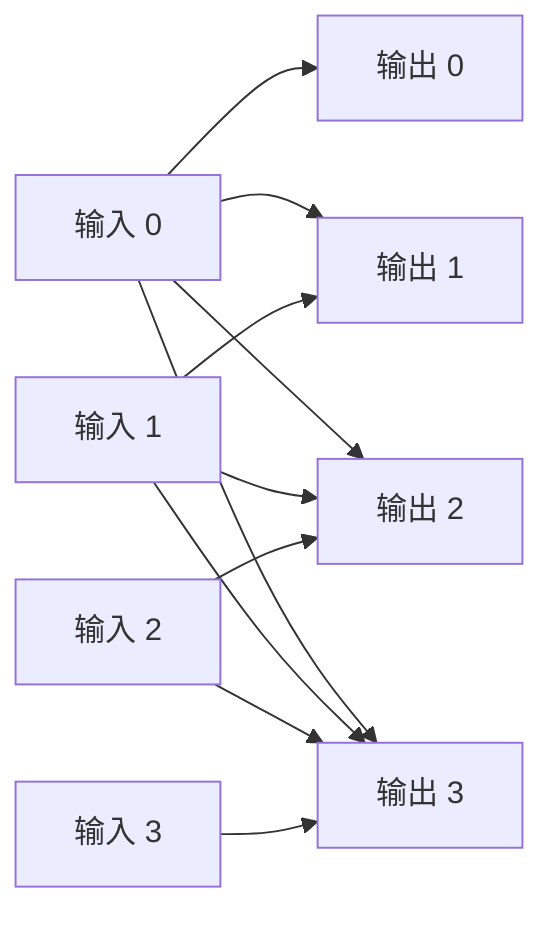
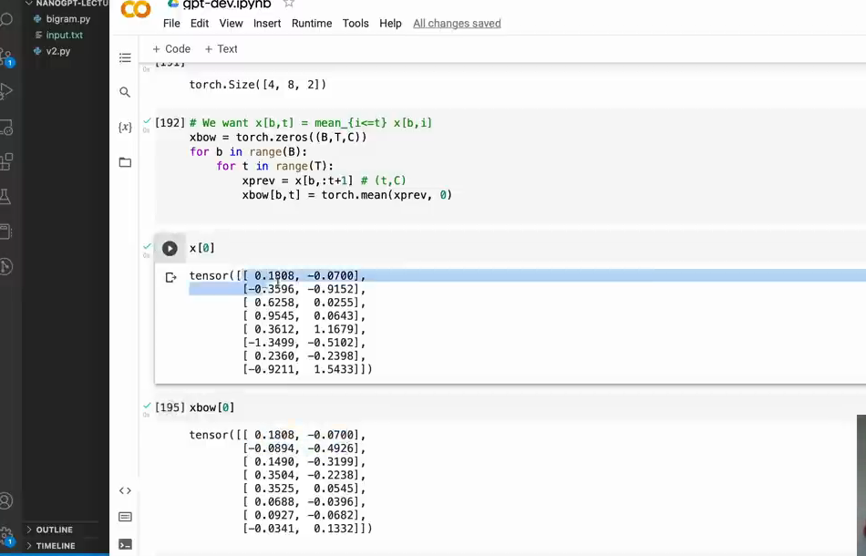

# 第 07 章：为什么 token 需要交流

`source_mode=video` · 视频 42:24–47:03 · M056–M061 · 预计 1–1.5 小时

## 1. 本章只解决什么问题

Bigram 只能看当前 token。本章先不碰 Attention，而是让每个位置读取自己和之前位置的平均值。目标是理解“因果通信”的输入输出，而不是追求好模型。

## 2. 学习前检查

你需要会三维 Shape `[B,T,C]` 的索引：B 是独立样本，T 是时间位置，C 是每个位置携带的数字。不会矩阵乘法也可以开始。

## 3. 不使用术语的直观例子

一排学生依次写下数字 `[2,4,9,5]`。规则是每个人只能读自己和左边：

```text
位置 0：平均 [2]       = 2
位置 1：平均 [2,4]     = 3
位置 2：平均 [2,4,9]   = 5
位置 3：平均 [2,4,9,5] = 5
```

位置 1 不能看未来的 9 和 5，因为生成位置 1 时它们还不存在。这叫因果限制。

如果每个位置不是一个数而是 C 个数，就对每个通道分别求平均。

下面的连线把“只能读自己和过去”画成数据流。越靠后的输出可以接收越多输入，但没有任何连线从未来指回过去：



本章先让所有允许连线使用相同权重，也就是前缀平均。Attention 会保留这张因果连接图，再让权重根据内容变化。

## 4. 跟着完成最小代码

### 本章与代码主线的关系

本章不新增 V 版本，只手写循环理解“每个位置读取自身和过去”。这段循环会作为 V4 的第一种实现保留；第 08 章加入矩阵与 mask 后，再运行完整 V4。现在不提前运行，是为了避免在尚未解释矩阵权重时看到后半段代码。

```python
import torch

B, T, C = 1, 4, 2
x = torch.tensor([[[2.0, 10.0],
                   [4.0, 20.0],
                   [9.0, 30.0],
                   [5.0, 40.0]]])
xbow = torch.zeros_like(x)

for b in range(B):
    for t in range(T):
        xprev = x[b, : t + 1]
        xbow[b, t] = xprev.mean(dim=0)

print(xbow)
```

## 5. 每行代码在做什么

- `x` 的一行 batch 有 4 个位置，每个位置 2 个通道。
- `zeros_like` 创建同 Shape、同类型的结果盒子。
- 外层循环逐个 batch，内层循环逐个时间位置。
- `:t+1` 包含位置 t；切片右端不包含，所以必须加 1。
- `xprev` 的 Shape 是 `[t+1,C]`。
- `mean(dim=0)` 消掉时间轴，对每个 C 通道分别平均，结果 `[C]`。
- 赋值给 `xbow[b,t]`，它也正好是 `[C]`。

## 6. Shape 变化卡片

以 `t=2` 为例：

```text
x                         [B,T,C] = [1,4,2]
x[0, :3]                  [3,2]
mean(dim=0)               [2]
写入 xbow[0,2]            [2]
最终 xbow                 [1,4,2]
```

`mean(dim=1)` 会平均 C 轴而得到 `[3]`，不是我们想要的结果。

视频把原始 `x` 和聚合后的 `xbow` 放在一起打印，可以检查每一行是否只汇总到当前位置：



*图：循环版前缀平均的输入与输出对照（原视频 M061，00:46:50）*

第一位置保持原值，后续位置逐渐纳入更多历史 token。输出仍是 `[B,T,C]`，因此下一章可以用矩阵乘法替换循环，而不用改变模型其余接口。

## 7. 为什么这样设计

前缀平均有两个教学价值：它严格遵守“不能看未来”，并且输出 Shape 与输入相同，可以接回模型。但它把多个历史位置压成均值，会丢失谁贡献了什么，也无法根据当前内容选择重要位置。

所以它不是最终 Attention，只是从“不交流”通往“按内容交流”的第一块踏板。

## 8. 常见误解与报错

- “之前”在本章包含当前位置自己。
- 不能对整个 `x[b]` 求平均，否则早期位置会偷看未来。
- batch 行必须分别循环；不同文本不能互相平均。
- 沿 T 平均，不是沿 C 平均。
- 平均后 Shape 不变，不代表信息没丢；不同序列可能有相同均值。
- `xbow` 名称可读作 x-bag-of-words，只是视频中的变量名，不是新的模型类型。

## 9. 完整示范

对第一通道 `[2,4,9,5]` 手算 `[2,3,5,5]`；第二通道 `[10,20,30,40]` 手算 `[10,15,20,25]`。运行代码后逐项核对：

```python
expected = torch.tensor([[[2.0, 10.0],
                          [3.0, 15.0],
                          [5.0, 20.0],
                          [5.0, 25.0]]])
assert torch.allclose(xbow, expected)
```

## 10. 填空模仿

```python
for b in range(B):
    for t in range(T):
        xprev = x[b, : ____]
        xbow[b, t] = xprev.mean(dim=____)
```

参考答案：`t + 1`、`0`。

## 11. 独立小任务

对 `[1,3,7,9]`：

1. 手算四个位置的允许读取集合；
2. 手算前缀平均；
3. 改成两个通道 `[值, 值×10]` 并验证；
4. 举出两组不同前缀，它们平均值相同，以证明平均会丢信息。

参考平均是 `[1,2,11/3,5]`。丢信息例子：`[1,3]` 和 `[0,4]` 的均值都是 2。

## 12. 过关标准

- 能手算每个位置允许读取哪些 token；
- 能实现循环版前缀平均；
- 能解释 `mean(dim=0)` 为什么保留 C；
- 能说明 batch 行不通信；
- 能指出前缀平均的因果优点和信息损失。

## 13. 暂时不用懂什么

暂时不用懂矩阵乘法、mask、softmax 和 Q/K/V。下一章只把同一个前缀平均改写成更适合并行的形式。

## 14. 原视频定位与 M 映射

| M | 原视频时间 | 本章用途 |
|---|---|---|
| M056 | 00:42:24–00:43:02 | `[B,T,C]` 与因果目标 |
| M057 | 00:43:02–00:43:50 | 读取自己及过去 |
| M058 | 00:43:50–00:44:42 | 前缀平均基线 |
| M059 | 00:44:42–00:45:28 | 双重循环 |
| M060 | 00:45:28–00:46:12 | 切片与沿时间平均 |
| M061 | 00:46:12–00:47:03 | 输入输出对照 |

[上一章：模型如何学习](../06-模型如何学习/README.md) · [返回课程目录](../README.md) · [下一章：矩阵乘法与因果 Mask](../08-矩阵乘法与因果Mask/README.md)
