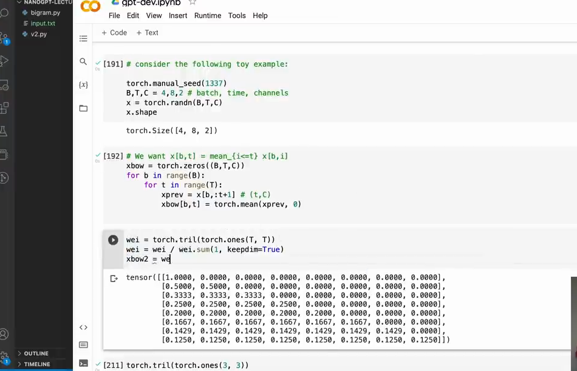

# 第 08 章：矩阵乘法与因果 Mask

`source_mode=video` · 视频 47:03–58:17 · M062–M076 · 预计 3–4 小时

## 1. 本章只解决什么问题

本章用矩阵乘法一次计算所有位置的前缀平均，再把“未来不可见”改写为 `masked_fill + softmax`。这是数学坡度最重要的一章，请亲手算小数字，不要背代码。

## 2. 学习前检查

你要能手算第 07 章循环版前缀平均，并知道 `[B,T,C]` 三个轴。除此之外不预设线性代数。

## 3. 不使用术语的直观例子

先看一行乘一列：

```text
[1, 2] 与 [10, 20] 配对
1×10 + 2×20 = 50
```

一行权重 `[0.5,0.5,0]` 乘三行值 `[2,4,9]`，得到 `0.5×2+0.5×4+0×9=3`。权重中的 0 表示不读取，两个 0.5 表示平均前两个位置。

把每个时间位置需要的权重排成行：

```text
[1,   0,   0, 0]
[1/2, 1/2, 0, 0]
[1/3, 1/3, 1/3, 0]
[1/4, 1/4, 1/4, 1/4]
```

这就是前缀平均权重矩阵。行代表“谁在读取”，列代表“从谁那里读取”。

同一组前缀权重可以分三阶段得到。先写哪些位置允许连接：

```text
下三角连接       行归一化权重          Mask 后分数       Softmax 后
[1,0,0]          [1,  0,  0]          [0,-∞,-∞]        [1,  0,  0]
[1,1,0]    →     [1/2,1/2,0]    或    [0, 0,-∞]   →    [1/2,1/2,0]
[1,1,1]          [1/3,1/3,1/3]        [0, 0, 0]        [1/3,1/3,1/3]
```

左边是直接把 1 归一化，右边是先用 `-inf` 禁止未来位置，再让 softmax 自动归一化。两条路线在分数全为 0 时得到相同结果；Attention 会把允许位置的 0 换成数据相关分数。

## 4. 跟着完成最小代码

运行三种等价实现：

```bash
python course/08-矩阵乘法与因果Mask/code/V4-prefix-average-demo.py
```

核心代码：

```python
tril = torch.tril(torch.ones(T, T))
weights = tril / tril.sum(dim=1, keepdim=True)
matrix_average = weights @ x

scores = torch.zeros(T, T)
scores = scores.masked_fill(tril == 0, float("-inf"))
softmax_weights = F.softmax(scores, dim=-1)
softmax_average = softmax_weights @ x
```

## 5. 每行代码在做什么

- `torch.ones(T,T)` 建全一方阵。
- `torch.tril` 保留下三角（含对角线），把未来位置变 0。
- `sum(dim=1, keepdim=True)` 对每行求和，并保留 `[T,1]` 形状。
- `[T,T] / [T,1]` 触发广播：每一行除以自己的行和。
- `weights @ x` 沿输入的 T 轴加权求和。
- 第三种写法先把所有允许位置设为相同分数 0，禁止位置设为 `-inf`。
- softmax 后，允许项得到相等正权重，`exp(-inf)=0` 使禁止项权重为 0。

## 6. Shape 变化卡片

设 `B=2,T=4,C=3`：

```text
tril / scores / weights       [4,4]
x                             [2,4,3]

批量理解：weights [4,4] 会广播给 2 个 batch
[4,4] @ [2,4,3]  →            [2,4,3]
  行T 共享T    C                 B  T  C
```

更明确地写成 `[B,T,T] @ [B,T,C] → [B,T,C]`。中间两个 T 配对并消失；左边第一个 T 成为输出位置。

`keepdim=True` 让行和保持 `[T,1]`，这样第 i 行能除以自己的一个数。若得到 `[T]`，广播会按最后一轴对齐，可能无报错却除错方向。

## 7. 为什么这样设计

矩阵乘法不是为了炫技，而是把大量独立加权和交给 PyTorch 并行执行。mask 把“哪些连接允许存在”从循环条件变成矩阵。

Softmax 的最低必需公式：

```text
softmax(z_i) = exp(z_i) / 所有允许项 exp(z_j) 的总和
```

若允许位置分数全是 0，则每个 `exp(0)=1`，归一化后自然得到均匀平均。

重要安全规则：mask 应作用于 logits，再 softmax。普通 Dropout 不能用于含 `-inf` 的 masked logits，因为运算可能产生 `0×(-inf)=nan`；Dropout 应放在 softmax 得到的有限权重上，或残差分支的有限输出上。

## 8. 常见误解与报错

- 权重矩阵的行是接收位置，列是来源位置；反过来会改变含义。
- 下三角必须包含对角线，否则位置 0 没有可读取项，整行 softmax 会变 `nan`。
- mask 里的 0 表示“不允许”，softmax 后的 0 才是实际零权重。
- `-inf` 不是很小的普通有限数，但 softmax 可将其变为严格零权重。
- 不要对 masked logits 做普通 Dropout；对 softmax 后权重做 Dropout。
- 批量矩阵乘法对每个 batch 分别算，不会把 batch 0 与 batch 1 相乘。
- `torch.allclose` 检查浮点近似相等；不要用列表视觉比较代替断言。

## 9. 完整示范

```python
import torch
from torch.nn import functional as F

x = torch.tensor([[[2.0], [4.0], [9.0], [5.0]]])
T = x.shape[1]
tril = torch.tril(torch.ones(T, T, dtype=torch.bool))

scores = torch.zeros(T, T)
scores = scores.masked_fill(~tril, float("-inf"))
weights = F.softmax(scores, dim=-1)
out = weights @ x

expected = torch.tensor([[[2.0], [3.0], [5.0], [5.0]]])
assert torch.allclose(out, expected)
assert torch.count_nonzero(torch.triu(weights, diagonal=1)) == 0
assert torch.allclose(weights.sum(dim=-1), torch.ones(T))
print(weights)
```

运行后应得到每行只在对角线及其左侧非零、并且行和为 1 的权重矩阵。视频中的输出给出了 `T=8` 时的完整数值：



*图：用下三角矩阵构造 `T×T` 归一化权重（原视频 M067，00:52:35）*

重点看每行非零项的数量逐行增加，数值依次为 `1`、`1/2`、`1/3`……。这正是循环版“读取到当前位置并求平均”的矩阵形式，而不是一段需要照抄的 Notebook 代码。

## 10. 填空模仿

```python
tril = torch.____(torch.ones(T, T, dtype=torch.bool))
scores = torch.____(T, T)
scores = scores.masked_fill(____tril, float("-inf"))
weights = F.softmax(scores, dim=____)
out = weights ____ x
```

参考答案：`tril`、`zeros`、`~`、`-1`、`@`。

## 11. 独立小任务

对 `x=[1,3,7]`（设 B=C=1）：

1. 手写 3×3 下三角矩阵；
2. 写出归一化权重；
3. 手算输出 `[1,2,11/3]`；
4. 用循环版、归一化矩阵版、mask+softmax 版实现并 `allclose`；
5. 把第 0 行对角线也 mask 掉，观察并解释 `nan`，然后恢复。

独立任务通过条件是三版 Shape 都为 `[1,3,1]`、数值近似相等、右上三角权重严格为 0。

## 12. 过关标准

- 能手算行乘列和加权和；
- 能解释 `T×T` 的行列语义；
- 能从下三角得到归一化前缀平均；
- 能解释广播、`keepdim` 与 batch 隔离；
- 能说明 `masked_fill + softmax` 各做什么；
- 能验证循环、矩阵和 softmax 三版等价；
- 知道不能对 masked logits 使用普通 Dropout。

## 13. 暂时不用懂什么

暂时不用懂 Q/K/V、缩放点积、矩阵求导和 GPU 内核。下一章先把 token ID 变成更丰富的内部特征，并加入位置。

## 14. 原视频定位与 M 映射

| M | 原视频时间 | 本章用途 |
|---|---|---|
| M062 | 00:47:03–00:47:48 | 行列组合 |
| M063 | 00:47:48–00:48:38 | 全一行求列和 |
| M064 | 00:48:38–00:49:32 | 下三角前缀和 |
| M065 | 00:49:32–00:50:28 | 行归一化 |
| M066 | 00:50:28–00:51:22 | 数字验证 |
| M067 | 00:51:22–00:52:50 | 构造权重矩阵 |
| M068 | 00:52:50–00:53:45 | 批量矩阵乘法 |
| M069 | 00:53:45–00:54:25 | `allclose` 等价检查 |
| M070 | 00:54:25–00:54:48 | batch 隔离 |
| M071 | 00:54:48–00:55:34 | 零分数与 tril |
| M072 | 00:55:34–00:56:18 | `-inf` 屏蔽未来 |
| M073 | 00:56:18–00:56:58 | softmax 还原权重 |
| M074 | 00:56:58–00:57:45 | 数据相关权重过渡 |
| M075 | 00:57:45–00:58:05 | 矩阵聚合 |
| M076 | 00:58:05–00:58:17 | 过渡 Self-Attention |

[上一章：为什么 token 需要交流](../07-token为什么需要交流/README.md) · [返回课程目录](../README.md) · [下一章：Embedding 与位置](../09-Embedding与位置/README.md)
