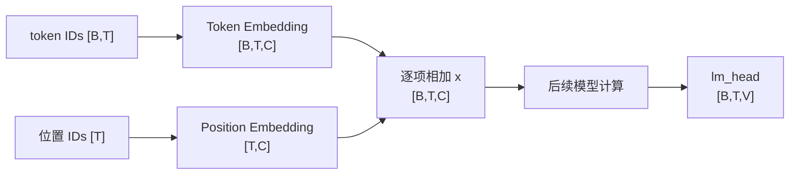
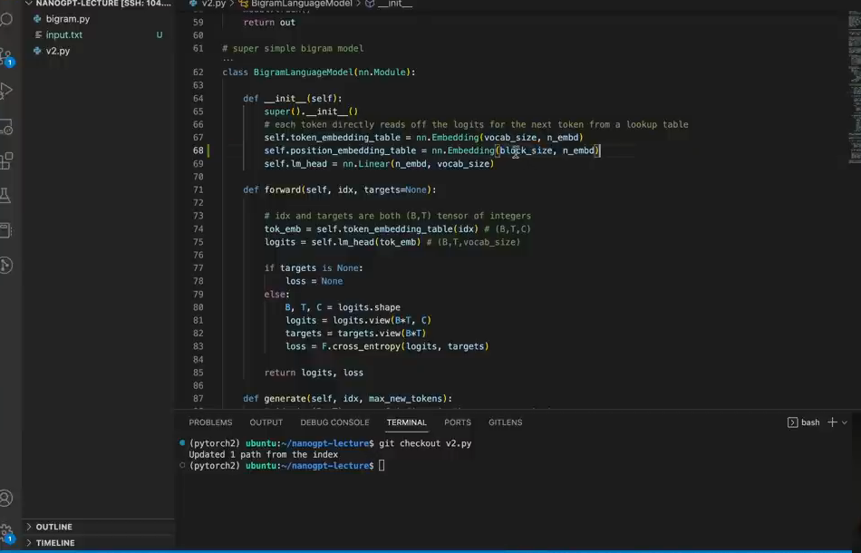

# 第 09 章：Embedding 与位置

`source_mode=video` · 视频 58:17–64:41 · M077–M085 · 预计 1.5–2 小时

## 1. 本章只解决什么问题

本章把 token ID 查成 C 个内部特征，并为序列位置另查 C 个特征。你会严格区分词表大小 V、序列长度 T 和特征宽度 C，再用 `lm_head` 把 C 映射回 V 个候选分数。

## 2. 学习前检查

你需要理解 Embedding 是查表、输入 ID Shape `[B,T]`，并会读广播。不会 Attention 也能开始。

## 3. 不使用术语的直观例子

编号只是通讯录页码。我们可以为每个字符保存 4 个可学习描述数：

```text
字符 a → [0.2, -0.1, 0.8, 0.3]
字符 b → [0.7,  0.4, 0.1, -0.2]
```

同一个字符出现在位置 0 与位置 5 时，token 表示相同，但位置表示不同。把两者逐项相加，就同时携带“我是谁”和“我在哪里”。

模型在内部先合并“内容”和“位置”，处理完成后再映射回词表候选：



V 只在输入查表和输出候选处出现；模型主体始终使用宽度 C。位置向量通过广播复用于每个 batch，但不同时间位置查到不同的行。

## 4. 跟着完成最小代码

### 本章与代码主线的关系

本章不新增独立 V 版本。下面的短例子足以隔离 token Embedding、position Embedding 和相加 Shape；它们会在第 12 章的 V6 中第一次接回带多头 Attention 的最小语言模型。当前只需把两路查表讲清，不必提前阅读 V6 的多头代码。

```python
import torch
from torch import nn

B, T, V, C = 2, 4, 10, 6
idx = torch.randint(V, (B, T))

token_table = nn.Embedding(V, C)
position_table = nn.Embedding(T, C)
lm_head = nn.Linear(C, V)

tok = token_table(idx)
pos = position_table(torch.arange(T))
x = tok + pos
logits = lm_head(x)

print(idx.shape, tok.shape, pos.shape, x.shape, logits.shape)
```

## 5. 每行代码在做什么

- `V` 是可选 token 种类数；`C` 是每个 token 在模型内部携带的数字数。
- `nn.Embedding(V,C)` 有 V 行 C 列；token ID 只用来选行。
- `torch.arange(T)` 生成 `[0,1,...,T-1]`。
- 位置表查出 `[T,C]`。
- `[B,T,C] + [T,C]` 时，PyTorch 把同一套位置向量复制给每个 batch。
- `nn.Linear(C,V)` 对每个位置独立把 C 个特征变成 V 个候选 logits。

## 6. Shape 变化卡片

```text
token IDs                         [B,T]
token embedding                   [B,T,C]
position IDs                      [T]
position embedding                [T,C]
广播相加                          [B,T,C]
lm_head                           [B,T,V]
```

旧 Bigram 中 Embedding 直接是 `[V,V]`。现在拆成 `[V,C]` 和 `Linear(C,V)`，中间空间不必与词表一样宽。

视频在这里把 token 表和新加入的位置表放在同一段模型初始化代码中，便于核对两张表的行列职责：



*图：模型同时建立 token 表和 position 表（原视频 M080，01:00:45）*

需要关注的是两张表的第一维来源不同：token 表按 V 个字符建行，位置表按 `block_size` 个位置建行；它们的第二维都等于 C，才能逐项相加。

## 7. 为什么这样设计

ID 大小没有语义，Embedding 给模型一个可学习的连续表示空间。位置表示是必要的，因为 Attention 自己只看内容匹配，交换两个位置后不会天然知道先后。

Token 与位置使用加法而非拼接，可保持宽度 C 不变，使后续每个 Block 都接收统一 Shape。加法会混合两类信息，但训练能学会使用它们。

固定平均虽然能传递历史，却无论内容都给同样权重。下一章让当前 token 根据内容决定读谁。

## 8. 常见误解与报错

- V 和 C 不再是同一个量；不要把 `[B,T,C]` 直接送入需要 `[B,T,V]` 的 loss。
- T 是当前实际长度，不能超过位置表容量 `block_size`。
- `torch.arange(T)` 默认在 CPU；模型在 CUDA 时要放到 `idx.device`。
- `[B,T,C]+[T,C]` 是按 batch 广播；如果写成 `[B,C,T]` 就不再对齐。
- 位置 embedding 不是 mask：它告诉模型位置，不能禁止未来信息。
- token ID 不是 embedding 向量；查表之后才得到 C 个数。

## 9. 完整示范

```python
import torch
from torch import nn

B, T, V, C = 2, 3, 5, 4
idx = torch.tensor([[0, 1, 2], [2, 1, 0]])
token_table = nn.Embedding(V, C)
position_table = nn.Embedding(8, C)

tok = token_table(idx)
pos = position_table(torch.arange(T))
x = tok + pos

assert tok.shape == x.shape == (B, T, C)
assert pos.shape == (T, C)
assert torch.allclose(x[0, 0] - tok[0, 0], x[1, 0] - tok[1, 0])
```

最后一个断言说明两个 batch 的位置 0 加的是同一个位置向量。

## 10. 填空模仿

```python
token_table = nn.Embedding(____, ____)
position_table = nn.Embedding(block_size, ____)
tok = token_table(idx)
pos = position_table(torch.____(T, device=idx.device))
x = tok ____ pos
logits = nn.Linear(C, ____)(x)
```

参考答案：`V`、`C`、`C`、`arange`、`+`、`V`。

## 11. 独立小任务

设 `B=3,T=5,V=20,C=8`：

1. 写出 token 表、position 表、两次查表、相加和 lm_head 输出 Shape；
2. 用代码验证；
3. 把同一个 token ID 放在两个位置，确认 token 向量相同而加位置后的向量不同；
4. 解释为什么位置编码不能替代因果 mask。

参考 Shape：token 表 `[20,8]`，位置表至少 `[5,8]`，tok `[3,5,8]`，pos `[5,8]`，x `[3,5,8]`，logits `[3,5,20]`。

## 12. 过关标准

- 能区分 token ID、V、T 与 C；
- 能画出 ID → token/position 表示 → `[B,T,C]` → logits 的路线；
- 能解释 `[B,T,C]+[T,C]` 的广播；
- 能说明位置编码和因果 mask 解决不同问题；
- 能说明固定平均为何不能按内容选择历史。

## 13. 暂时不用懂什么

暂时不用懂正弦位置编码、RoPE、权重绑定和高维空间几何。下一章只用线性层从 `[B,T,C]` 产生 Q、K、V。

## 14. 原视频定位与 M 映射

| M | 原视频时间 | 本章用途 |
|---|---|---|
| M077 | 00:58:17–00:59:21 | `n_embd` 中间空间 |
| M078 | 00:59:21–01:00:00 | `lm_head` 映射回 V |
| M079 | 01:00:00–01:00:23 | 区分 embedding 维与 vocab 维 |
| M080 | 01:00:23–01:01:05 | 位置表 |
| M081 | 01:01:05–01:01:26 | `arange` 位置索引 |
| M082 | 01:01:26–01:02:02 | 广播相加 |
| M083 | 01:02:02–01:02:28 | Bigram 位置限制 |
| M084 | 01:02:28–01:03:36 | 均匀平均限制 |
| M085 | 01:03:36–01:04:41 | Q/K 过渡 |

[上一章：矩阵乘法与因果 Mask](../08-矩阵乘法与因果Mask/README.md) · [返回课程目录](../README.md) · [下一章：单头 Self-Attention](../10-单头Self-Attention/README.md)
