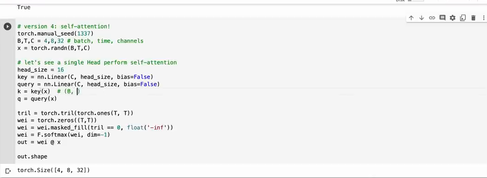

# 第 10 章：单头 Self-Attention

`source_mode=video` · 视频 64:41–71:08 · M086–M093 · 预计 3–4 小时

## 1. 本章只解决什么问题

本章把固定前缀平均升级为单头因果 Self-Attention。每个 token 产生 Query、Key、Value：用 Q 与 K 决定读谁，用权重搬运 V。你不需要背公式，但必须能逐步解释数据流和 Shape。

## 2. 学习前检查

你应理解 `[B,T,C]`、`[B,T,T] @ [B,T,H]`、因果 mask 和 softmax，也应知道线性层会改变最后一轴宽度。H 表示一个注意力头内部的特征宽度。

## 3. 不使用术语的直观例子

在图书馆里：

- Query（查询）：“我现在想找什么线索？”
- Key（键）：“我这里能被怎样的需求匹配？”
- Value（值）：“如果你选中我，我真正提供什么信息？”

当前位置的 Query 与所有允许历史位置的 Key 做配对打分。分数高的历史位置贡献更多 Value。Key 用于匹配，Value 才是被搬运的内容。

一个二维点积例子：`q=[1,2]`，`k=[3,4]`，相似分数为 `1×3+2×4=11`。若另一个 key 是 `[-1,0]`，分数为 -1，前者会在 softmax 后得到更高权重。

## 4. 视频关键片段与画面

- `64:41–66:53`（M086–M088）：可学习分数、Q/K 线性层和 K 转置。
- `66:53–68:51`（M089–M090）：从固定权重到内容相关权重及元音/辅音类比。
- `68:51–70:04`（M091–M092）：原始分数、因果 mask 和 softmax。
- `70:04–71:08`（M093）：加入 Value 完成信息聚合。



## 5. 跟着完成最小代码

```python
import torch
from torch.nn import functional as F

B, T, C, H = 2, 4, 6, 3
x = torch.randn(B, T, C)
key = torch.nn.Linear(C, H, bias=False)
query = torch.nn.Linear(C, H, bias=False)
value = torch.nn.Linear(C, H, bias=False)

k = key(x)
q = query(x)
v = value(x)
scores = q @ k.transpose(-2, -1) * H**-0.5

mask = torch.tril(torch.ones(T, T, dtype=torch.bool))
scores = scores.masked_fill(~mask, float("-inf"))
weights = F.softmax(scores, dim=-1)
out = weights @ v
```

运行 V5：

```bash
python 05-Self-Attention/code/V5-single-head-demo.py
```

## 6. 每行代码在做什么

- 三个 `Linear(C,H,bias=False)` 都对每个 token 独立工作，不在此处混合时间。
- `q/k/v` 都是 `[B,T,H]`，但参数不同，职责不同。
- `k.transpose(-2,-1)` 把最后两轴从 `[T,H]` 换成 `[H,T]`。
- `q @ kᵀ` 让每个 Query 位置与每个 Key 位置配对，得到 `[B,T,T]`。
- `H**-0.5` 等于 `1/√H`；其原因在下一章实验。
- mask 把未来分数变 `-inf`。
- softmax 把每一行变成对允许来源的权重。
- `weights @ v` 按这些权重汇总 Value，得到 `[B,T,H]`。

## 7. Shape 变化卡片

```text
x                              [B,T,C]
q, k, v                        [B,T,H]
k.transpose(-2,-1)             [B,H,T]
q @ kᵀ                         [B,T,T]
mask + softmax                 [B,T,T]
weights @ v                    [B,T,H]
```

分数矩阵的两个 T 含义不同：行 T 是“谁发起查询”，列 T 是“查哪个来源”。输出保留查询位置那一个 T。

## 8. 为什么这样设计

固定平均只依赖位置；QK 分数依赖当前输入 x，所以同一位置在不同句子中可选择不同历史。Value 独立存在，让“是否相关”和“被选中后提供什么”可以分别学习。

三个最小公式：

```text
score = Q @ Kᵀ / √H
weights = softmax(mask(score))
out = weights @ V
```

它们是对前面三件已学动作的组合：点积打分、mask 禁止未来、加权和搬运信息。

## 9. 常见误解与报错

- Q、K、V 不是三份 token ID，而是同一个 x 经过三套不同参数的投影。
- Key 参与打分，Value 参与输出；不要写 `weights @ k` 代替 Value。
- K 必须转置最后两个轴，而不是交换 batch 轴。
- mask 不能放在 Q/K 线性层前；它约束的是位置间连接。
- softmax 要沿来源列，即最后一轴。
- Self-Attention 的 “self” 表示 Q、K、V 都来自同一个 x，不表示只能看自己。
- 当前章一个 head 输出 H，不一定等于 C；多头拼接后再回到 C。

## 10. 完整示范

手算一个查询对两个 key：

```python
import torch
from torch.nn import functional as F

q = torch.tensor([[1.0, 2.0]])          # [1,2]
k = torch.tensor([[3.0, 4.0], [-1.0, 0.0]])  # [2,2]
v = torch.tensor([[10.0, 0.0], [0.0, 20.0]])

scores = q @ k.T
weights = F.softmax(scores, dim=-1)
out = weights @ v

assert scores.tolist() == [[11.0, -1.0]]
assert out.shape == (1, 2)
print(scores, weights, out)
```

第一个来源的权重会非常接近 1，因此输出接近 `[10,0]`。

## 11. 填空模仿

```python
k = key(x)
q = query(x)
v = value(x)
scores = q @ k.____(-2, -1) * H ** ____
scores = scores.masked_fill(____mask, float("-inf"))
weights = F.softmax(scores, dim=____)
out = weights @ ____
```

参考答案：`transpose`、`-0.5`、`~`、`-1`、`v`。

## 12. 独立小任务

设 `B=2,T=3,C=4,H=2`：

1. 写出 x、Q/K/V、K 转置、scores、weights 和 out 的 Shape；
2. 运行 V5，检查每行权重和为 1、右上角为 0；
3. 临时把 Value 的某一行改成明显数字，观察它怎样按权重进入输出；
4. 不用公式，用三句话分别解释 Q、K、V。

Shape 参考：`[2,3,4] → 3×[2,3,2]`，scores/weights `[2,3,3]`，out `[2,3,2]`。

## 13. 过关标准

- 能用“寻找什么、能被怎样匹配、提供什么”解释 Q/K/V；
- 能手算点积并解释 K 转置；
- 能对比固定权重与数据相关权重；
- 能按顺序解释 QK、缩放、mask、softmax、Value 聚合；
- 能推出单头注意力全程 Shape。

## 14. 暂时不用懂什么

暂时不用懂多头、FlashAttention、KV cache、投影矩阵的几何证明和缩放方差推导。下一章把 Attention 的可见规则、batch 和缩放分别说清。

## 15. 视频时间与 M 映射

| M | 时间 | 本章用途 |
|---|---|---|
| M086 | 01:04:41–01:05:21 | 可学习匹配分数 |
| M087 | 01:05:21–01:06:03 | Q/K 线性投影 |
| M088 | 01:06:03–01:06:53 | K 转置 |
| M089 | 01:06:53–01:07:44 | 内容相关权重 |
| M090 | 01:07:44–01:08:51 | Q/K 类比 |
| M091 | 01:08:51–01:09:24 | 原始 scores |
| M092 | 01:09:24–01:10:04 | mask 与 softmax |
| M093 | 01:10:04–01:11:08 | Value 聚合 |

[上一章：Embedding 与位置](../09-Embedding与位置/README.md) · [返回课程目录](../README.md) · [下一章：Attention 的规则和缩放](../11-Attention规则与缩放/README.md)
