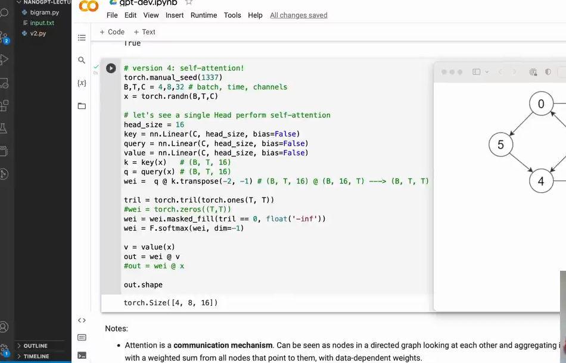

# 第 11 章：Attention 的规则和缩放

`source_mode=video` · 视频 71:08–79:13 · M094–M101 · 预计 2–3 小时

## 1. 本章只解决什么问题

本章不增加新模块，而是防止把 Attention 的三类机制混成一个：mask 决定能否连接，位置表示告诉先后，Q/K 决定允许连接中的内容权重。随后用实验解释为什么分数除以 `√H`。

## 2. 学习前检查

你应能画出单头注意力 Shape，知道 softmax 一行对应一个查询位置，并能说出 Q/K/V 各自职责。

## 3. 不使用术语的直观例子

把四个 token 画成四个点。生成任务允许的箭头是：

```text
0 ← 0
1 ← 0,1
2 ← 0,1,2
3 ← 0,1,2,3
```

这是有向图：2 能读 0，不代表 0 能读 2。mask 只删掉不允许的箭头；在剩下的箭头中，Q/K 决定粗细；位置 embedding 让节点携带自己的序号信息。

## 4. 视频关键片段与画面

- `71:08–73:11`（M094–M095）：Attention 是有向图通信，自回归对应下三角图。
- `73:11–75:19`（M096–M097）：Attention 无天然位置，batch 是多张互不通信的图。
- `75:19–77:18`（M098–M099）：encoder/decoder mask 与 self/cross-attention。
- `77:18–79:13`（M100–M101）：`√H` 缩放保持 softmax 不过尖。



## 5. 跟着完成最小代码

比较缩放前后：

```python
import torch
from torch.nn import functional as F

torch.manual_seed(1)
for H in (4, 64, 256):
    q = torch.randn(1000, H)
    k = torch.randn(1000, H)
    raw = (q * k).sum(dim=-1)
    scaled = raw * H**-0.5
    print(H, raw.var().item(), scaled.var().item())

scores = torch.tensor([[0.0, 1.0, 8.0]])
print(F.softmax(scores, dim=-1))
print(F.softmax(scores / 4, dim=-1))
```

观察：H 变大时 raw 方差变大；缩放后方差大致稳定。很大的分数差让 softmax 几乎只选一项。

## 6. 每行代码在做什么

- 随机 q/k 每个分量方差约为 1。
- H 个乘积相加时，波动规模随 H 增大。
- 乘 `H**-0.5` 即除以 `√H`，把典型波动拉回稳定量级。
- Softmax 太尖时，多数位置权重接近 0，训练初期的调整空间会变差。

Batch 的准确说法：每个 batch 行前向计算自己的注意力图，绝不读取其他行；所有行的 loss 通常取平均，所以它们会共同贡献同一组参数的梯度。

## 7. Shape 变化卡片

同一个 `[B,T,T]` 可以看成 B 张图：

```text
batch 0：T×T 邻接/权重矩阵
batch 1：T×T 邻接/权重矩阵
...
堆叠后：[B,T,T]
```

Self-Attention：Q、K、V 的 T 都来自同一序列。

Cross-Attention 若目标长 `Tq`、来源长 `Tk`：

```text
Q [B,Tq,H] @ Kᵀ [B,H,Tk] → weights [B,Tq,Tk]
weights [B,Tq,Tk] @ V [B,Tk,H] → [B,Tq,H]
```

## 8. 为什么这样设计

三类规则必须分开：

| 问题 | 机制 | 是否随内容变化 |
|---|---|---|
| 能不能读未来？ | 因果 mask | 否，任务规则固定 |
| 这是第几个位置？ | position embedding | 随位置，不随句子内容 |
| 允许范围内更该读谁？ | Q/K 分数 | 是 |

Self 与 cross 的区别是数据来源，不是是否使用 mask。Encoder self-attention 常允许双向读取；decoder self-attention 使用因果 mask；cross-attention 的 Q 来自 decoder，K/V 来自 encoder。

## 9. 常见误解与报错

- 有位置编码不等于看不到未来；必须有 mask。
- 有 mask 不等于知道相距多远；必须有位置信息。
- batch 独立不等于参数独立；同一个模型参数服务所有行。
- self-attention 不必是因果的；encoder self-attention 通常不是。
- cross-attention 不表示“两种权重相交”，而是 Q 与 K/V 来自不同序列。
- 缩放用 `√H`，H 是每头宽度，不是模型总宽 C、时间 T 或 batch B。
- 缩放不是把 softmax 结果再除；它作用在 softmax 前的 scores。

## 10. 完整示范

给 T=4 的因果图写邻接矩阵，1 表示允许：

```python
import torch

allowed = torch.tril(torch.ones(4, 4, dtype=torch.int64))
assert allowed.tolist() == [
    [1, 0, 0, 0],
    [1, 1, 0, 0],
    [1, 1, 1, 0],
    [1, 1, 1, 1],
]
```

第 2 行允许读 0、1、2；具体三项权重仍由 Q/K 内容分数决定。

## 11. 填空模仿

```text
“看不到未来”由 ____ 决定。
“知道自己在第几个位置”由 ____ 决定。
“按内容选择历史”由 ____ 决定。
Self-Attention 的 Q/K/V 来自 ____。
Cross-Attention 的 Q 来自目标侧，K/V 来自 ____。
```

参考答案：因果 mask、位置表示、Q/K 分数、同一个输入序列、来源/encoder 侧序列。

## 12. 独立小任务

1. 为 T=5 画完整因果有向图或 5×5 允许矩阵；
2. 用一句话区分 mask、位置和内容匹配；
3. 设 `B=3,Tq=4,Tk=7,H=8`，写 cross-attention 全程 Shape；
4. 运行缩放实验，记录 H=4 与 H=256 的 raw/scaled 方差；
5. 解释 batch 行为何既“互不通信”又“共同学习”。

Shape 参考：Q `[3,4,8]`、K/V `[3,7,8]`、weights `[3,4,7]`、out `[3,4,8]`。

## 13. 过关标准

- 能用有向图解释因果可见范围；
- 能区分 mask、位置编码和 Q/K 内容匹配；
- 能准确说明 batch 隔离与共同梯度；
- 能区分 self-attention 与 cross-attention；
- 能用实验说明除以 `√H` 的必要性。

## 14. 暂时不用懂什么

暂时不用懂严格概率方差证明、训练稳定性理论、双向语言模型和现代位置编码。下一章只复制多个 head 并拼接结果。

## 15. 视频时间与 M 映射

| M | 时间 | 本章用途 |
|---|---|---|
| M094 | 01:11:08–01:12:09 | 有向图通信 |
| M095 | 01:12:09–01:13:11 | 自回归图 |
| M096 | 01:13:11–01:14:15 | 无天然位置概念 |
| M097 | 01:14:15–01:15:19 | batch 多张独立图 |
| M098 | 01:15:19–01:16:23 | encoder/decoder mask |
| M099 | 01:16:23–01:17:18 | self/cross 数据来源 |
| M100 | 01:17:18–01:18:18 | `√H` 缩放 |
| M101 | 01:18:18–01:19:13 | softmax 过尖问题 |

[上一章：单头 Self-Attention](../10-单头Self-Attention/README.md) · [返回课程目录](../README.md) · [下一章：Multi-Head Attention](../12-Multi-Head-Attention/README.md)
