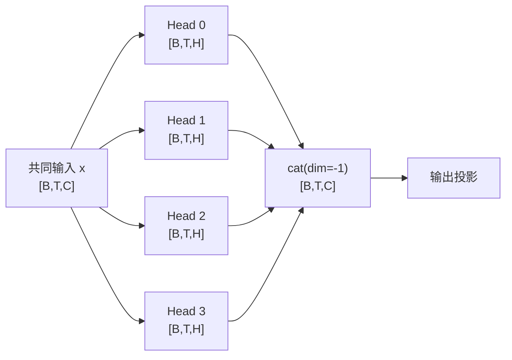
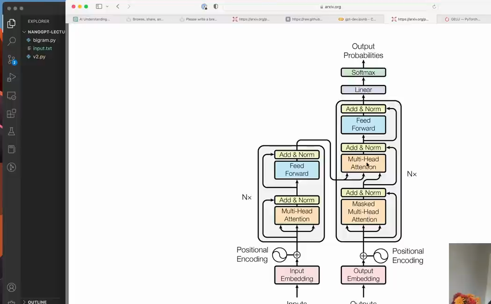

# 第 12 章：Multi-Head Attention

`source_mode=video` · 视频 79:13–84:45 · M102–M108 · 预计 1.5–2 小时

## 1. 本章只解决什么问题

本章把单头封装成 `Head`，并行运行多个较小的头，再沿特征轴拼接回 C。还会解释 `register_buffer`、`ModuleList` 和生成时的上下文裁剪。

## 2. 学习前检查

你应能独立解释单头 Q/K/V 和 `[B,T,T] @ [B,T,H] → [B,T,H]`。并确认 `C` 能被头数整除。

## 3. 不使用术语的直观例子

一位读者可能只用一种“相关标准”看历史。多头像四位读者并行阅读：每位都有自己的 Q/K/V 参数，可以学不同关系；每位写 8 个数字，最后拼成 32 个数字。

```text
head 0：[B,T,8]
head 1：[B,T,8]
head 2：[B,T,8]
head 3：[B,T,8]
沿最后一轴拼接 → [B,T,32]
```

“不同头一定分别学语法、情感、指代”只是可能的解释，不是代码保证。

多头结构可以看成先分流、各自计算，再沿特征轴合流：



每个头都能看到完整输入，但只能输出 H 个特征。拼接后恢复 C，后续 Block 才能保持统一宽度并进行残差相加。

## 4. 跟着完成最小代码

```python
class MultiHeadAttention(nn.Module):
    def __init__(self, n_embd, num_heads, block_size):
        super().__init__()
        assert n_embd % num_heads == 0
        head_size = n_embd // num_heads
        self.heads = nn.ModuleList([
            Head(n_embd, head_size, block_size)
            for _ in range(num_heads)
        ])

    def forward(self, x):
        return torch.cat([head(x) for head in self.heads], dim=-1)
```

运行 V6：

```bash
python course/12-Multi-Head-Attention/code/V6-multi-head-attention.py
```

## 5. 每行代码在做什么

- 整除断言保证每头宽度是整数。
- `ModuleList` 像 Python 列表，但会让 PyTorch 注册其中各 Head 的参数、设备与训练状态。
- 每个 Head 接收同一个 `[B,T,C]`，但使用自己独立参数，输出 `[B,T,H]`。
- 列表推导执行全部头。
- `torch.cat(...,dim=-1)` 沿 H/C 特征轴拼接，不增加新的“头轴”。

Head 内：

```python
self.register_buffer("tril", torch.tril(torch.ones(block_size, block_size)))
```

tril 需要随模型移动设备、保存状态，但不应被 optimizer 更新，所以注册为 buffer 而不是 parameter。

生成时只保留最近 `block_size` 个 token：`idx[:, -block_size:]`。位置表和 mask 只能处理这么长的窗口。

## 6. Shape 变化卡片

设 `C=32,num_heads=4,H=8`：

```text
共同输入 x                    [B,T,32]
每头 Q/K/V                    [B,T,8]
每头输出                      [B,T,8]
4 个输出 cat(dim=-1)          [B,T,32]
```

每头内部都有自己的 `[B,T,T]` 权重，但拼接的是 Value 聚合后的 `[B,T,H]`，不是拼接权重矩阵。

## 7. 为什么这样设计

多个小头允许同一 token 同时形成多套相关性权重。总输出宽度保持 C，方便后续残差加法和 Block 堆叠。

`ModuleList` 解决“Python 能循环”和“PyTorch 知道这些子模块存在”之间的差异。普通 list 中的层可能不会被 `model.parameters()`、`.to(device)` 和 checkpoint 正确管理。

上下文裁剪不是丢掉本轮最后 token，而是丢掉过远历史，保持当前长度不超过训练设定的窗口。

多头 Attention 在完整 Transformer 中不是孤立模块。视频回到原论文架构图，指出它在 decoder 子层中的位置：



*图：原始 Transformer 架构中的 Multi-Head Attention 组件（原视频 M108，01:24:42）*

这张来源图用于建立架构坐标：本章刚完成的是注意力子层，后面还要补 FeedForward、残差连接和 LayerNorm，才能组成可堆叠的 Block。

## 8. 常见误解与报错

- `head_size=C` 再做多个头会把输出膨胀为 `num_heads×C`；本课设 `H=C/num_heads`。
- `stack` 会新增头轴 `[B,T,num_heads,H]`，本实现需要 `cat` 得到 `[B,T,C]`。
- 多个头不是多个 batch；每个头都处理所有 batch。
- 普通 Python list 不是合适的可训练子模块容器，应使用 `ModuleList`。
- buffer 不是不可变常量；它只是无需梯度的模块状态。
- `idx[:, -block_size:]` 保留最近窗口；不要写成 `idx[-block_size:]`，那会切 batch 轴。

## 9. 完整示范

```python
import torch

h0 = torch.zeros(2, 3, 2)
h1 = torch.ones(2, 3, 2)
joined = torch.cat([h0, h1], dim=-1)

assert joined.shape == (2, 3, 4)
assert joined[0, 0].tolist() == [0.0, 0.0, 1.0, 1.0]
```

这只演示拼接。真正不同头的输出不是全 0/1，而是各自的 Attention 结果。

## 10. 填空模仿

```python
assert n_embd % num_heads == ____
head_size = n_embd ____ num_heads
self.heads = nn.____([
    Head(n_embd, head_size, block_size)
    for _ in range(num_heads)
])
return torch.____([head(x) for head in self.heads], dim=____)
```

参考答案：`0`、`//`、`ModuleList`、`cat`、`-1`。

## 11. 独立小任务

1. 对 `C=48` 分别计算 3、6、8 头的 H；
2. 对 `C=30,num_heads=8` 解释断言为何失败；
3. 运行 V6，核对四头拼接与生成上下文裁剪；
4. 把 `cat` 临时改为 `stack`，记录 Shape 并说明为何不能直接残差相加，然后恢复。

参考：48/3=16，48/6=8，48/8=6；30 不能被 8 整除。

## 12. 过关标准

- 能手算 `C=32、4 头、每头 8`；
- 能解释多头在哪里并行、在哪里拼接；
- 能说明 `ModuleList` 与普通 list 的差异；
- 能说明 tril 为什么是 buffer；
- 能正确裁剪时间轴上的上下文。

## 13. 暂时不用懂什么

暂时不用懂合并 QKV、四维向量化头、FlashAttention 和多查询注意力。第 16 章才把课堂写法映射到 nanoGPT 工程写法。

## 14. 原视频定位与 M 映射

| M | 原视频时间 | 本章用途 |
|---|---|---|
| M102 | 01:19:13–01:20:17 | Head 与 buffer |
| M103 | 01:20:17–01:20:51 | 接入 token/位置表示 |
| M104 | 01:20:51–01:21:37 | 裁剪上下文与超参数 |
| M105 | 01:21:37–01:22:18 | 单头结果与局限 |
| M106 | 01:22:18–01:23:03 | ModuleList 多头 |
| M107 | 01:23:03–01:23:46 | 四个 8 维头拼成 32 |
| M108 | 01:23:46–01:24:45 | 结果与架构定位 |

[上一章：Attention 的规则和缩放](../11-Attention规则与缩放/README.md) · [返回课程目录](../README.md) · [下一章：FeedForward、Block 与残差](../13-FeedForward-Block与残差/README.md)
