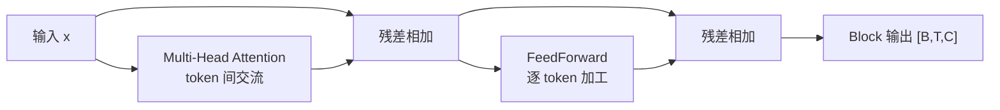
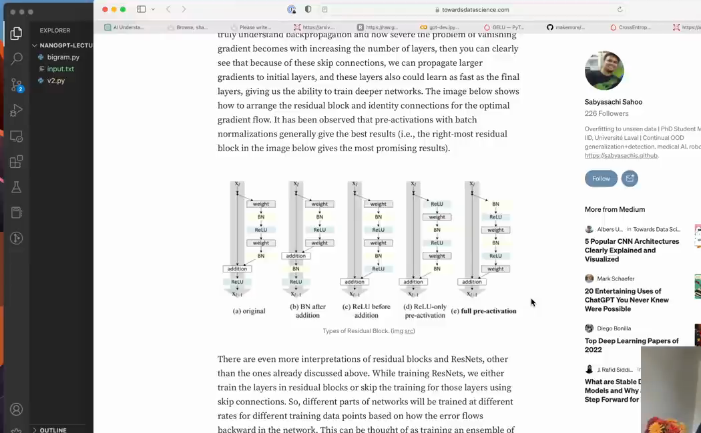

# 第 13 章：FeedForward、Block 与残差

`source_mode=video` · 视频 84:45–92:44 · M109–M120 · 预计 3–4 小时

## 1. 本章只解决什么问题

Attention 完成 token 间交流，但还需要让每个 token 独立加工收到的信息。本章加入 FeedForward（FFN），把 Attention 与 FFN 组成 Block，再用残差连接为深层模型保留直接的数据和梯度通路。

## 2. 学习前检查

你应能确认多头 Attention 输入输出都是 `[B,T,C]`，并知道 `nn.Linear` 只改变最后一轴。梯度只需第 06 章的方向直觉。

## 3. 不使用术语的直观例子

把课堂分成两步：

1. 交流：每位学生读取同组其他人的信息——Attention；
2. 各自思考：每位学生单独加工自己的笔记——FFN。

FFN 对所有位置使用同一套函数，但绝不把位置 0 的数拿给位置 1。残差连接则像保留原笔记：新结果是 `原笔记 + 加工建议`，即使加工分支暂时很差，原信息仍有直路。

一个 Block 交替执行“通信”和“独立加工”，每个分支外都保留主路：



两条分支最终都回到宽度 C，所以可以与主路逐项相加。Block 输出 Shape 不变，下一层才能继续接收同一种接口。

## 4. 跟着完成最小代码

FFN：

```python
class FeedForward(nn.Module):
    def __init__(self, n_embd):
        super().__init__()
        self.net = nn.Sequential(
            nn.Linear(n_embd, 4 * n_embd),
            nn.ReLU(),
            nn.Linear(4 * n_embd, n_embd),
        )

    def forward(self, x):
        return self.net(x)
```

Block 的残差骨架（LayerNorm 下一章加入）：

```python
def forward(self, x):
    x = x + self.sa(x)
    x = x + self.ffwd(x)
    return x
```

### 主线 V7、V8 与本章的关系

本章有两个互相独立的实验文件：[V7](./code/V7-feed-forward.py)只证明 FFN 不混合 token，[V8](./code/V8-residual-connection.py)只证明残差主路能保留前向值和梯度。它们不是在 V6 文件上不断追加的完整模型；两个概念会在下一章的 V9 中正式合并进 Block。

在项目根目录运行：

```bash
python course/13-FeedForward-Block与残差/code/V7-feed-forward.py
python course/13-FeedForward-Block与残差/code/V8-residual-connection.py
```

### 运行结果怎么读

V7 应输出：

```text
输入/输出形状： (2, 4, 8)
修改第 0 个词元不会影响后续词元的输出：是
```

V8 应输出：

```text
前向传播初始为恒等映射： 是
梯度原样传到输入： 是
```

两个“是”不是装饰文字：打印之前已有断言验证对应张量。V7 改 token 0 后，位置 1–3 的输出必须保持相同；V8 把分支权重清零后，输出必须等于输入且输入梯度全为 1。

## 5. 每行代码在做什么

- 第一个 Linear 把每个 token 从 C 扩到 4C，提供更宽的中间计算空间。
- ReLU 把负值变 0，使多层不再等价于一个线性变换。
- 第二个 Linear 投影回 C，才能与输入相加。
- `nn.Sequential` 按顺序调用其中层。
- `x + self.sa(x)` 先通信并保留旧 x。
- `x + self.ffwd(x)` 再逐 token 加工并保留通信后的 x。

多头 Attention 末尾的 output projection 把拼接的头混合回统一 C；FFN 末尾投影把 4C 压回 C。两者都为残差 Shape 对齐服务，但参数不共享。

### 完整 V7 代码导读

V7 的 `FeedForward` 只使用 `Linear(C,C)+ReLU`，比本章上方最终采用的 `C→4C→C` 更小。这里故意只隔离“每个 token 独立计算”这一性质；四倍扩展和第二层 Linear 会在 V9 的完整 Block 中加入。

| 代码区块 | 作用 |
|---|---|
| `FeedForward.__init__/forward` | 用 `Sequential` 对最后一个 C 轴逐位置应用同一组参数 |
| `changed = x.clone(); changed[:,0] += 10` | 只制造一个位置不同的对照输入 |
| 两次 `layer(...)` | 保证对照组经过完全相同的 FFN 参数 |
| 三个断言 | 检查 Shape、未改位置不受影响、被改位置确实改变 |
| 主入口 | 直接运行时调用 `demo()` 并打印结论 |

### 完整 V8 代码导读

| 代码区块 | 作用 |
|---|---|
| `ResidualLayer` | 建立一个 C→C 分支并把权重初始化为 0 |
| `return x + self.branch(x)` | 明确保留不经过分支的恒等主路 |
| `requires_grad=True` | 要求 autograd 为输入 x 保存梯度 |
| `out.sum().backward()` | 用最简单标量目标触发反向传播 |
| 两个断言 | 分别验证 `out==x` 与 `x.grad==1` |

分支初始化为 0 只是为了把恒等路径展示得完全可见，不代表实际 Transformer 的所有残差分支都必须这样初始化。V8 验证的是 `x+F(x)` 这条接线本身。

## 6. Shape 变化卡片

```text
x                              [B,T,C]
MultiHeadAttention             [B,T,C]
x + attention                  [B,T,C]
FFN Linear(C,4C)               [B,T,4C]
ReLU                           [B,T,4C]
FFN Linear(4C,C)               [B,T,C]
x + ffwd                       [B,T,C]
```

哪些混合 token：Attention 的 `[T,T] @ V`。哪些不混合 token：Linear、ReLU、FFN，它们只沿每个位置的 C 运算。

## 7. 为什么这样设计

若只有 Attention，token 可以加权复制和混合历史值，但逐位置的非线性变换能力有限。FFN 提供独立计算；交替堆叠让“交流后的结果”在下一层又能影响新的交流。

残差的最低必需梯度直觉：

```text
y = x + F(x)
```

即使 F 分支的梯度很弱，x→y 的加法仍提供一条导数为 1 的直接路径。它不能保证训练成功，但显著缓解深层信号传递困难。

视频用主干和旁路图强调，残差并不是用分支替换输入，而是把分支结果加回原信号：



*图：残差连接为数据和梯度保留直接通路（原视频 M116，01:29:30）*

观察时沿着直线主路走一遍，再沿 F(x) 分支走一遍；两路在加法节点汇合。只保留分支输出就会失去这条“梯度高速公路”。

## 8. 常见误解与报错

- FFN 不是把整个序列展平后处理；它对每个 `[C]` 位置独立复用。
- 4C 是常用 Transformer 设计，不是数学定律。
- 残差加法两侧 Shape 必须完全一致；因此分支最终回到 C。
- 写成 `x = self.sa(x); x = self.ffwd(x)` 就没有残差主路。
- 残差不是把不同 batch 相加。
- ReLU 不混合 token；修改位置 0 不应影响 FFN 对位置 1 的输出。
- 深层 loss 变差可能是优化问题，不应直接断定更多层一定更差。

## 9. 完整示范

验证 FFN 不混合位置：

```python
import torch
from torch import nn

ffn = nn.Sequential(nn.Linear(4, 16), nn.ReLU(), nn.Linear(16, 4))
x = torch.randn(1, 3, 4)
changed = x.clone()
changed[:, 0] += 100

out = ffn(x)
changed_out = ffn(changed)
assert not torch.allclose(out[:, 0], changed_out[:, 0])
assert torch.allclose(out[:, 1:], changed_out[:, 1:])
```

## 10. 填空模仿

```python
self.net = nn.Sequential(
    nn.Linear(C, ____),
    nn.____(),
    nn.Linear(____, C),
)

def forward(self, x):
    x = x ____ self.sa(x)
    x = x ____ self.ffwd(x)
    return x
```

参考答案：`4 * C`、`ReLU`、`4 * C`、`+`、`+`。

## 11. 独立小任务

1. 设 `B=2,T=8,C=32`，写出 FFN 每层 Shape；
2. 运行 V7 并验证修改 token 0 不影响其他位置；
3. 运行 V8，说明分支初始为 0 时为何 `out=x` 且输入梯度为 1；
4. 在本章 Block 代码中标出两个混合 token 的位置和所有逐 token 操作。

参考：真正混合 T 的是两个 MultiHeadAttention 调用内部；FFN、LayerNorm 和残差加法都不会跨 token 混合。

## 12. 过关标准

- 能区分 Attention 的交流与 FFN 的逐 token 计算；
- 能推出 `C→4C→C`；
- 能解释 ReLU 的最低作用；
- 能说出 Block 为何交替交流和思考；
- 能用 `x+F(x)` 与最小实验解释残差；
- 能指出哪些操作混合 token，哪些不混合。

## 13. 暂时不用懂什么

暂时不用懂 GELU、SwiGLU、残差初始化理论和深度缩放规律。下一章只加入归一化，并确定它放在分支前还是后。

## 14. 原视频定位与 M 映射

| M | 原视频时间 | 本章用途 |
|---|---|---|
| M109 | 01:24:45–01:25:28 | FFN 位置 |
| M110 | 01:25:28–01:26:12 | Linear+ReLU |
| M111 | 01:26:12–01:26:53 | loss 与 Block 过渡 |
| M112 | 01:26:53–01:27:28 | 交流/计算交替 |
| M113 | 01:27:28–01:27:55 | 分头与堆叠 |
| M114 | 01:27:55–01:28:34 | 深层优化困难 |
| M115 | 01:28:34–01:29:14 | ResNet 背景 |
| M116 | 01:29:14–01:29:52 | 加法与梯度直路 |
| M117 | 01:29:52–01:30:30 | 梯度高速公路 |
| M118 | 01:30:30–01:31:10 | 两个残差分支 |
| M119 | 01:31:10–01:32:08 | 投影与四倍 FFN |
| M120 | 01:32:08–01:32:44 | 训练结果与过拟合 |

[上一章：Multi-Head Attention](../12-Multi-Head-Attention/README.md) · [返回课程目录](../README.md) · [下一章：LayerNorm 与 Pre-Norm](../14-LayerNorm与Pre-Norm/README.md)
