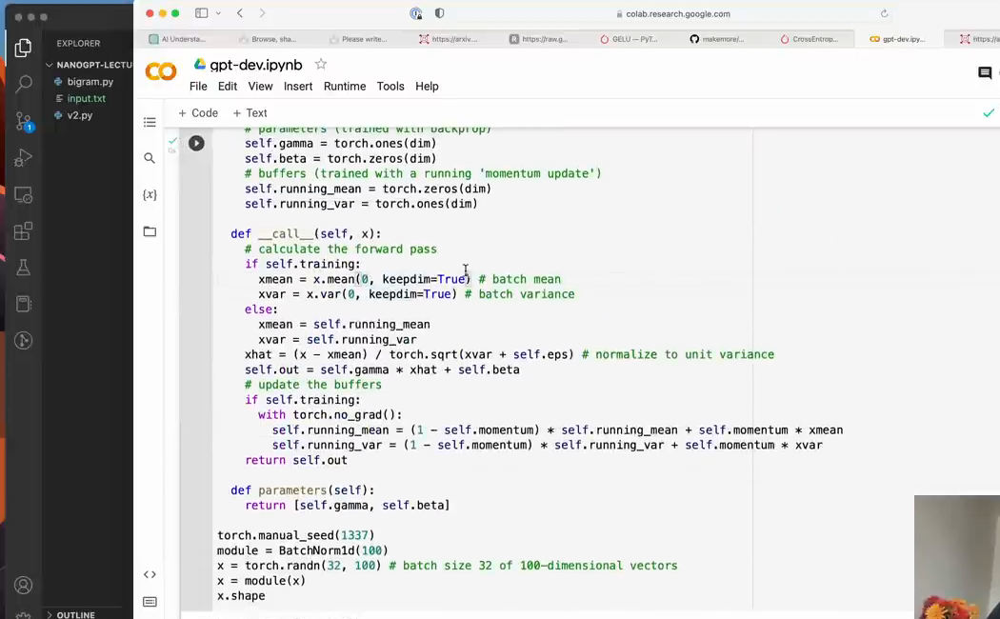

# 第 14 章：LayerNorm 与 Pre-Norm

`source_mode=video` · 视频 92:44–97:49 · M121–M128 · 预计 2–3 小时

## 1. 本章只解决什么问题

本章从一行小数字理解标准化，再区分 BatchNorm 与 LayerNorm。最后把两个独立 LayerNorm 放到 Attention 和 FFN 分支之前，组成 pre-norm Block。

## 2. 学习前检查

你应理解 Block 的两条残差分支，知道 `[B,T,C]` 中每个 token 是一个长度 C 的向量。只需会平均和平方，不要求统计学背景。

## 3. 不使用术语的直观例子

一行数字 `[1,2,3]`：

```text
均值 = 2
减均值 = [-1,0,1]
平方后的平均 = (1+0+1)/3 = 2/3
除以标准差后，整体中心接近 0、尺度接近 1
```

LayerNorm 对每个 token 自己的 C 个特征做这件事。它不需要读取其他 token 或其他 batch。

## 4. 视频关键片段与画面

- `92:44–93:58`（M121–M122）：从 BatchNorm 出发，跨样本按特征归一化。
- `93:58–95:14`（M123–M124）：LayerNorm 改为每个样本/位置的特征归一化，保留 gamma/beta。
- `95:14–96:23`（M125–M126）：post-norm 与 pre-norm，两个 LayerNorm 接线。
- `96:23–97:49`（M127–M128）：统计 C 轴和 final LayerNorm。



## 5. 跟着完成最小代码

```python
import torch
from torch import nn

x = torch.tensor([[[1.0, 2.0, 3.0],
                   [10.0, 20.0, 30.0]]])
ln = nn.LayerNorm(3)
y = ln(x)
print(y)
print(y.mean(dim=-1))
print(y.var(dim=-1, unbiased=False))
```

Pre-norm Block：

```python
class Block(nn.Module):
    def __init__(self, C, n_head, block_size):
        super().__init__()
        self.sa = MultiHeadAttention(C, n_head, block_size)
        self.ffwd = FeedForward(C)
        self.ln1 = nn.LayerNorm(C)
        self.ln2 = nn.LayerNorm(C)

    def forward(self, x):
        x = x + self.sa(self.ln1(x))
        x = x + self.ffwd(self.ln2(x))
        return x
```

运行本章完整 V9：

```bash
python course/14-LayerNorm与Pre-Norm/code/V9-transformer-block.py
```

## 6. 每行代码在做什么

- `nn.LayerNorm(C)` 表示最后 C 个特征是一组。
- 对 `[B,T,C]`，它为每个 `(b,t)` 单独计算均值与方差。
- 内部可学习 `gamma` 和 `beta` 各有 C 个数，用于缩放和平移标准化结果。
- `ln1` 与 `ln2` 是两个对象，参数不共享；它们面对不同分支输入。
- pre-norm 先归一化再进子层，残差主路上的 x 不被归一化打断。
- 完整 GPT 在所有 Block 后还使用一个 final LayerNorm，再进 lm_head。

最低必需公式：

```text
normalized = (x - mean) / sqrt(variance + epsilon)
output = gamma * normalized + beta
```

epsilon 是防止分母为 0 的很小正数。

## 7. Shape 变化卡片

```text
x                              [B,T,C]
每个 token 的 mean/variance    [B,T,1]
LayerNorm 输出                 [B,T,C]
gamma / beta 参数              [C]
```

LayerNorm 不改变 Shape，也不混合 T。BatchNorm 的典型统计方向不同，不能只看两者名字中的 “Norm”。

## 8. 为什么这样设计

归一化让不同层收到的数值尺度更稳定，通常更容易优化。gamma/beta 允许模型在有用时恢复或改变尺度，因此不是把所有信息永久固定成均值 0、方差 1。

原始 Transformer 论文常画 post-norm：`LayerNorm(x+F(x))`；课程采用现代常见 pre-norm：`x+F(LayerNorm(x))`。Pre-norm 为残差主路保留更直接的恒等通道。本课只要求理解数据流差异，不声称某一种在所有设置都绝对更好。

## 9. 常见误解与报错

- LayerNorm 不是跨 batch 统计，不依赖 batch 大小。
- 对 `[B,T,C]` 时统计最后 C 轴，不是整个 B×T×C。
- `torch.var` 默认设置可能与 LayerNorm 内部方差定义不同；实验时用 `unbiased=False`。
- 输出不一定精确均值 0/方差 1，因为有 epsilon 和可学习 gamma/beta。
- `ln1 = ln2 = nn.LayerNorm(C)` 会让两个名字引用同一对象；应分别构造。
- final LayerNorm 不替代 Block 内的两个 LayerNorm。
- pre/post 指归一化相对子层和残差加法的位置，不是训练前后阶段。

## 10. 完整示范

```python
import torch
from torch import nn

x = torch.randn(2, 4, 8)
ln1 = nn.LayerNorm(8)
ln2 = nn.LayerNorm(8)
y1, y2 = ln1(x), ln2(x)

assert y1.shape == x.shape
assert ln1.weight is not ln2.weight
assert torch.allclose(y1.mean(dim=-1), torch.zeros(2, 4), atol=1e-5)
```

初始时两个层的 gamma/beta 相同，所以 y1/y2 数值可相同；对象和参数仍是独立的，训练后可分化。

## 11. 填空模仿

```python
self.ln1 = nn.LayerNorm(____)
self.ln2 = nn.LayerNorm(____)

def forward(self, x):
    x = x + self.sa(self.____(x))
    x = x + self.ffwd(self.____(x))
    return x
```

参考答案：`C`、`C`、`ln1`、`ln2`。

## 12. 独立小任务

1. 手算 `[1,2,3]` 的均值、方差和未带 gamma/beta 的标准化近似值；
2. 对随机 `[2,3,4]` 张量运行 `LayerNorm(4)`，核对最后轴均值/方差；
3. 画 pre-norm 与 post-norm 数据流；
4. 检查 V9 中两个 LayerNorm 不是同一参数对象。

手算参考：均值 2，方差 2/3，标准化约 `[-1.225,0,1.225]`（忽略 epsilon）。

## 13. 过关标准

- 能从一行数字计算均值、方差和标准化；
- 能区分 BatchNorm 与 LayerNorm 的统计方向；
- 能解释 gamma、beta 与 epsilon；
- 能在 `[B,T,C]` 中指出 LayerNorm 统计 C；
- 能画出 pre-norm 与 post-norm；
- 能说明两个 LayerNorm 不共享参数。

## 14. 暂时不用懂什么

暂时不用懂 RMSNorm、数值稳定证明、归一化消融实验和大模型规范化变体。下一章不再引入新结构，只把已学模块组装完整。

## 15. 视频时间与 M 映射

| M | 时间 | 本章用途 |
|---|---|---|
| M121 | 01:32:44–01:33:20 | BatchNorm 过渡 |
| M122 | 01:33:20–01:33:58 | 跨样本按特征统计 |
| M123 | 01:33:58–01:34:36 | LayerNorm 统计方向 |
| M124 | 01:34:36–01:35:14 | gamma/beta 与无运行统计 |
| M125 | 01:35:14–01:35:52 | post-norm / pre-norm |
| M126 | 01:35:52–01:36:23 | 两个 LayerNorm 接线 |
| M127 | 01:36:23–01:36:54 | 每 token 的 C 轴 |
| M128 | 01:36:54–01:37:49 | final norm 与结构完成 |

[上一章：FeedForward、Block 与残差](../13-FeedForward-Block与残差/README.md) · [返回课程目录](../README.md) · [下一章：完整 GPT 的组装](../15-完整GPT组装/README.md)
