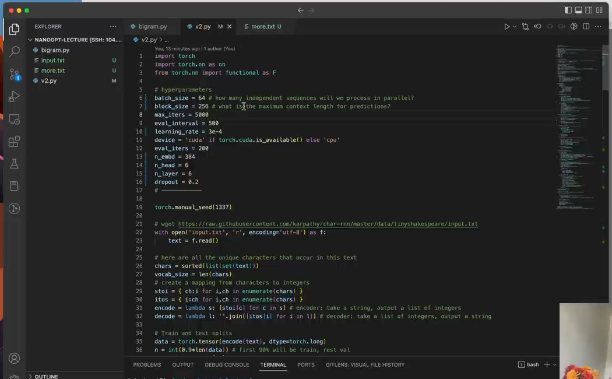

# 第 15 章：完整 GPT 的组装与查漏补缺

`source_mode=video` · 视频 97:49–1:42:43 · M129–M136 · 预计 2–3 小时

## 1. 本章只解决什么问题

本章是综合组装，不重新教授前 14 章概念。唯一新增的核心知识是 Dropout 和规模化参数/资源成本。你要把 token 输入、多个 Block、loss、训练和生成连成一条可讲述、可运行的路径。

V10 是必做终点。V11、checkpoint、perplexity、temperature 和 top-k 只放在结课选学。

## 2. 学习前检查

若以下任一项说不清，请先回对应章：`[B,T]→[B,T,C]`、Q/K/V、Multi-Head 拼接、FFN、残差、pre-norm、`[B,T,C]→[B,T,V]`、训练五步、生成五步。

## 3. 不使用术语的直观例子

把完整模型当成工厂：

```text
字符编号
  → 加入“是什么字符”和“在哪个位置”
  → 多轮“相互交流 + 各自加工”
  → 整理数值尺度
  → 为 65 个下个字符打分
  → 训练时对答案算错；生成时抽一个字符
```

Dropout 像训练时随机让部分支路贡献暂时归零，迫使模型不依赖单一通道；评估时自动关闭，使用完整网络。

## 4. 视频关键片段与画面

- `97:49–98:30`（M129–M130）：整理层数/头数参数和 Dropout 位置。
- `98:30–99:34`（M131–M132）：随机子网络集成直觉和缓解过拟合。
- `99:34–1:40:37`（M133–M134）：放大 batch、上下文、宽度、头数、层数，降低学习率。
- `1:40:37–1:42:43`（M135–M136）：A100 结果、低配边界和生成分析。



## 5. 跟着完成最小代码

完整前向骨架：

```python
def forward(self, idx, targets=None):
    B, T = idx.shape
    tok = self.token_embedding_table(idx)
    pos = self.position_embedding_table(torch.arange(T, device=idx.device))
    x = tok + pos
    x = self.blocks(x)
    x = self.ln_f(x)
    logits = self.lm_head(x)

    loss = None
    if targets is not None:
        B, T, V = logits.shape
        loss = F.cross_entropy(logits.reshape(B * T, V), targets.reshape(B * T))
    return logits, loss
```

必做：

```bash
python 08-完整GPT训练与生成/code/V10-complete-gpt.py
```

保持默认小配置。它用于普通电脑上的结构和训练闭环验收，不追求复现视频的大配置 loss。

## 6. 每行代码在做什么

这次不要逐行重新背 API，而要为每行标来源：

- token/position embedding：第 09 章；
- blocks：第 10–14 章组合；
- final LayerNorm：第 14 章；
- lm_head 与 cross-entropy：第 04 章；
- optimizer 与评估：第 06 章；
- generate：第 05 章，加上上下文裁剪。

Dropout 的正确位置：

```python
weights = F.softmax(masked_scores, dim=-1)
weights = self.dropout(weights)       # 在有限权重上
out = self.dropout(projection(out))   # 或分支有限输出上
```

不要对含 `-inf` 的 `masked_scores` 直接做普通 Dropout。

## 7. Shape 变化卡片

```text
idx                              [B,T]
token + position                 [B,T,C]
每个 Block 输入/输出             [B,T,C]
final LayerNorm                  [B,T,C]
lm_head                          [B,T,V]

训练：reshape                    [B×T,V] + [B×T] → loss []
生成：最后位置                   [B,V] → 抽样 [B,1] → [B,T+1]
```

Block 内部会临时出现 `[B,T,T]`、`[B,T,H]` 和 `[B,T,4C]`，但 Block 边界始终保持 `[B,T,C]`。

## 8. 为什么这样设计

### Dropout

训练时每次随机屏蔽一部分有限激活/权重，相当于训练许多共享参数的子网络；评估时关闭并使用全部通路。它是一种缓解过拟合的正则化，不会凭空提升模型容量。

### 规模化参数

| 参数 | 增大时主要影响 | 主要成本 |
|---|---|---|
| batch_size B | 一次更新平均更多样本 | 激活内存、每步计算 |
| block_size T | 可使用更长上下文 | Attention 权重约按 T² 增长 |
| n_embd C | 每个 token 表示更宽 | 大多数层参数与计算增长 |
| n_head | 并行关系子空间更多 | 总 C 固定时每头 H 变小 |
| n_layer | 交流/计算轮数更多 | 参数、激活和时间近似随层数增长 |
| dropout | 随机屏蔽强度 | 太大可能欠拟合 |

视频大配置在 A100 上训练约 15 分钟并得到约 1.48 的 loss；普通电脑默认 V10 参数、步数和数据抽样不同，不能直接比较数值。

## 9. 常见误解与报错

- 第 15 章不是“把所有名词再讲一遍”；若出现陌生核心概念，应回前章。
- Dropout 只在训练模式随机；生成前应 `model.eval()`。
- Dropout 不能修复未来泄漏，因果 mask 仍必需。
- `n_embd % n_head == 0` 必须成立。
- T 增大时 Attention 的 T×T 内存增长很快。
- 视频生成像莎士比亚不证明语义理解；格式、拼写和常见局部模式足以产生外观。
- V10 默认只训练少量步用于验收；输出不流畅是预期，不是终点结构失败。

## 10. 完整示范

阅读 V10 时填一张组装追踪表：

| 代码对象 | 输入 | 输出 | 首次教学章 |
|---|---|---|---|
| token embedding | `[B,T]` | `[B,T,C]` | 09 |
| one Head | `[B,T,C]` | `[B,T,H]` | 10 |
| MultiHead | `[B,T,C]` | `[B,T,C]` | 12 |
| FeedForward | `[B,T,C]` | `[B,T,C]`（内部 4C） | 13 |
| Block | `[B,T,C]` | `[B,T,C]` | 13–14 |
| lm_head | `[B,T,C]` | `[B,T,V]` | 09 |

逐项在源码中找到对应类和调用，找不到的项目才算真正卡点。

## 11. 填空模仿

```text
输入 ID 的 Shape 是 ____。
加 token/position 后是 ____。
经过任意数量 Block 后是 ____。
lm_head 后是 ____。
训练 loss 前展平为 ____；生成时只取 ____ 位置。
```

参考答案：`[B,T]`、`[B,T,C]`、`[B,T,C]`、`[B,T,V]`、`[B×T,V]`、最后时间。

## 12. 独立小任务

1. 运行 V10 并记录设备、参数量、loss 与生成长度；
2. 从 `idx` 开始，口头完整讲到抽出下一个 token；
3. 标出 V10 中所有 Dropout，确认都作用在 softmax 后权重或有限分支输出；
4. 只把 `N_LAYER` 从 2 改 3，预测参数量和时间方向，运行后恢复；
5. 说明视频 loss 与本地 loss 为什么不可直接比较。

任务通过条件不是生成流畅，而是代码完成训练/生成、Shape 路线无断点、无本章偷偷出现的第三个新核心概念。

## 13. 过关标准

- 能从 token 输入完整讲到下一个 token 生成；
- 能把 V10 的每个模块指回已学章节；
- 能解释 Dropout 的训练/评估差异和安全位置；
- 能说明 B、T、C、头数、层数的作用与成本；
- 能区分格式模仿和语义理解；
- 能把 V10 视为清晰必学终点。

## 14. 暂时不用懂什么

V11、checkpoint、perplexity、temperature、top-k、混合精度、分布式训练和现代架构都是选学。想继续可读 [V11 结课工程](../../capstone/README.md)，但现在直接进入第 16 章也算完整完成代码主线。

## 15. 视频时间与 M 映射

| M | 时间 | 本章用途 |
|---|---|---|
| M129 | 01:37:49–01:38:08 | n_layer/n_head 参数整理 |
| M130 | 01:38:08–01:38:30 | Dropout 位置 |
| M131 | 01:38:30–01:39:06 | 子网络集成直觉 |
| M132 | 01:39:06–01:39:34 | 缓解过拟合 |
| M133 | 01:39:34–01:40:04 | 放大 B/T/C 与降低学习率 |
| M134 | 01:40:04–01:40:37 | 六头六层与 0.2 Dropout |
| M135 | 01:40:37–01:41:16 | A100 结果与低配边界 |
| M136 | 01:41:16–01:42:43 | 生成文本与编程结束 |

[上一章：LayerNorm 与 Pre-Norm](../14-LayerNorm与Pre-Norm/README.md) · [返回课程目录](../README.md) · [下一章：Decoder-Only 与 nanoGPT](../16-Decoder-Only与nanoGPT/README.md)
