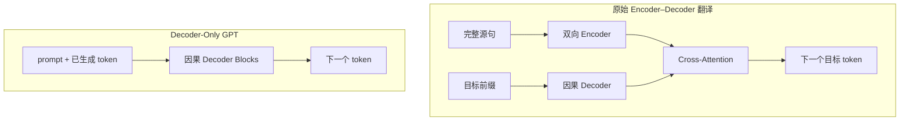
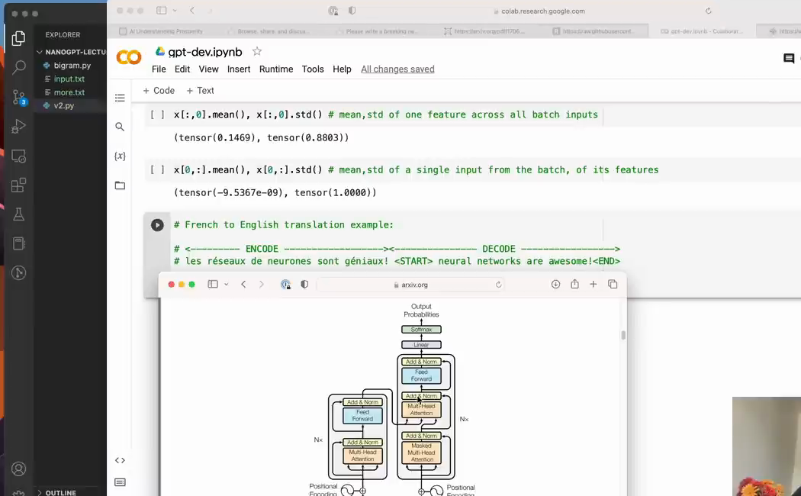

# 第 16 章：Decoder-Only、原始 Transformer 与 nanoGPT

`source_mode=video` · 视频 1:42:43–1:49:00 · M137–M148 · 预计 1.5–2 小时

## 1. 本章只解决什么问题

本章给 V10 准确定位：它是 decoder-only Transformer。你会把它与原始 encoder–decoder 翻译架构对比，并看懂 nanoGPT 为什么代码更紧凑但数学骨架相同。

## 2. 学习前检查

你应已完成 V10，能解释因果 self-attention，并见过第 11 章的 cross-attention Shape。此章不要求运行大型训练。

## 3. 不使用术语的直观例子

翻译任务有两份序列：完整法语源句已经给定，英语目标句要逐步生成。因此需要：

```text
Encoder：先通读完整法语，任意位置可双向交流
Decoder：只看已生成英语前缀
Cross-Attention：英语位置去法语表示中检索信息
```

普通 GPT 续写只有一条 token 流：prompt 已经是同一序列的前缀，后续输出继续接在后面。所以它不需要独立 Encoder 和 Cross-Attention。

两种架构最关键的差异是有几条输入流，以及目标侧是否需要单独读取来源侧：



视频在原 Transformer 图上标出课程模型保留的 decoder 主干，可以把抽象对照落到真实架构位置：



*图：课程 GPT 只保留原架构中的因果 decoder 主干（原视频 M137，01:42:55）*

这里的“只保留 decoder”是架构定位，不是删到只剩一个输出层。Embedding、masked self-attention、FFN、残差和 LayerNorm 都仍在 decoder Block 中。

## 4. 跟着完成最小代码

用 Shape 模拟不同源/目标长度：

```python
import torch

B, T_target, T_source, H = 2, 3, 5, 4
q = torch.randn(B, T_target, H)
k = torch.randn(B, T_source, H)
v = torch.randn(B, T_source, H)

scores = q @ k.transpose(-2, -1)
weights = torch.softmax(scores, dim=-1)
out = weights @ v

assert scores.shape == (B, T_target, T_source)
assert out.shape == (B, T_target, H)
```

这不是新增 Cross-Attention 层实现，只用已学矩阵验证“Q 与 K/V 可来自不同长度”。

## 5. 每行代码在做什么

- Q 的时间轴属于正在生成的目标序列。
- K/V 的时间轴属于完整来源序列。
- 分数矩阵每一行问：“这个目标位置应从各源位置读多少？”
- GPT self-attention 中 `T_target=T_source=T` 且三者来自同一个 x。

nanoGPT 的紧凑写法：一个 Linear 一次产生宽度 `3C`，再切成 q/k/v；把通道 reshape 成 `[B,T,n_head,H]` 并转成 `[B,n_head,T,H]`，一次并行计算所有头。课堂版用 `ModuleList` 显式循环，便于看见每头。

## 6. Shape 变化卡片

### 原翻译 Cross-Attention

```text
Q target                     [B,T_target,H]
K/V source                   [B,T_source,H]
weights                      [B,T_target,T_source]
out                          [B,T_target,H]
```

### nanoGPT 合并多头

```text
x                            [B,T,C]
one Linear(C,3C)             [B,T,3C]
split q/k/v                  3 × [B,T,C]
reshape heads                3 × [B,n_head,T,H]
attention output             [B,n_head,T,H]
merge heads                  [B,T,C]
```

这里只是把“多个独立 Head 循环”改成一个显式头轴，数学上仍是每头 QK、mask、softmax、V。

## 7. 为什么这样设计

架构由信息是否已经可用决定。Encoder 处理完整已知输入，不需要因果 mask；Decoder 生成未知未来，必须因果；Cross-Attention 让目标侧读取已知源侧。

GPT 把 prompt 与输出放在同一 token 流中：prompt token 位于左边，输出 token 在右边通过因果 Attention 读取 prompt。它因此能做“给定提示续写”，但不代表所有条件生成任务都必须放弃 encoder。

nanoGPT 还加入数据加载、分布式训练、混合精度、checkpoint 等工程能力。这些改变效率和可恢复性，不改变本课程已学的核心 Block 数据流。

## 8. 常见误解与报错

- decoder-only 不表示“只有输出层”；它仍有 Embedding、Attention、FFN、残差和 LayerNorm。
- Encoder 无因果 mask 不等于泄漏目标答案；它读取的是已给定源序列。
- START/END 是词表中的特殊 ID，需要训练学会使用，不是自动控制语句。
- Cross-Attention 的源长和目标长可不同，因此权重不一定是方阵。
- nanoGPT 合并 QKV 不表示只有一套相同参数；一个大权重矩阵的不同切片仍可学习不同投影。
- 四维多头是向量化表示，不是多出一层语义结构。
- V11 的 checkpoint 只是教材工程补充，不属于 M137–M148 的课程代码终点。

## 9. 完整示范

用翻译例子列信息来源：

```text
法语源：[START, les, chats, dorment, END]  T_source=5
英语目标输入：[START, cats]                T_target=2

Encoder self-attention：5×5，完整双向
Decoder self-attention：2×2，下三角
Cross-attention：2×5，每个英语位置读取 5 个法语位置
```

## 10. 填空模仿

```text
Encoder 的 Q/K/V 来自 ____，通常使用 / 不使用因果 mask。
Decoder self-attention 的 Q/K/V 来自 ____，使用 / 不使用因果 mask。
Cross-Attention 的 Q 来自 ____，K/V 来自 ____。
若目标长 4、源长 7，权重 Shape 为 ____。
```

参考答案：encoder 输入、不使用；decoder 当前状态、使用；decoder、encoder；`[B,4,7]`。

## 11. 独立小任务

1. 在原 Transformer 图中指出 V10 保留的 masked self-attention、FFN、残差、LayerNorm；
2. 指出它删除的 Encoder 与 Cross-Attention；
3. 设 `B=2,T_target=6,T_source=9,H=8`，手写 cross-attention Shape；
4. 用一张表把课堂 `ModuleList` 多头映射到 nanoGPT `[B,n_head,T,H]`；
5. 说明 prompt 与输出怎样处于同一 token 流。

参考核对：Cross-Attention 的 weights 应为 `[2,6,9]`、输出 `[2,6,8]`；课堂每个 Head 的 H 对应四维实现最后一轴，多个 Head 对应 `n_head` 轴。

## 12. 过关标准

- 能区分 Encoder、Decoder、因果注意力和 Cross-Attention；
- 能用 START/END 解释翻译目标序列；
- 能手算源/目标长度不同的 Shape；
- 能在原图中指出课程保留和删除的部分；
- 能把课堂多头映射到 nanoGPT 合并 QKV 与四维实现；
- 能说明工程紧凑不等于数学结构不同。

## 13. 暂时不用懂什么

暂时不用懂分布式数据并行、FlashAttention、混合精度、编译器优化和 nanoGPT 全部配置项。最后一章只建立预训练模型成为助手的概念地图。

## 14. 原视频定位与 M 映射

| M | 原视频时间 | 本章用途 |
|---|---|---|
| M137 | 01:42:43–01:43:20 | decoder-only 定位 |
| M138 | 01:43:20–01:43:45 | 翻译双塔背景 |
| M139 | 01:43:45–01:44:22 | START/END |
| M140 | 01:44:22–01:44:50 | 目标侧需要源条件 |
| M141 | 01:44:50–01:45:26 | Encoder 双向读取 |
| M142 | 01:45:26–01:45:53 | Cross-Attention 来源 |
| M143 | 01:45:53–01:46:26 | GPT 只保留 decoder |
| M144 | 01:46:26–01:46:56 | nanoGPT 训练工程 |
| M145 | 01:46:56–01:47:28 | 课堂 Head 对应关系 |
| M146 | 01:47:28–01:47:59 | 四维并行多头 |
| M147 | 01:47:59–01:48:30 | MLP/Block 映射 |
| M148 | 01:48:30–01:49:00 | checkpoint/生成与过渡 |

[上一章：完整 GPT 的组装](../15-完整GPT组装/README.md) · [返回课程目录](../README.md) · [下一章：从预训练到 ChatGPT 式助手](../17-从预训练到ChatGPT/README.md)
